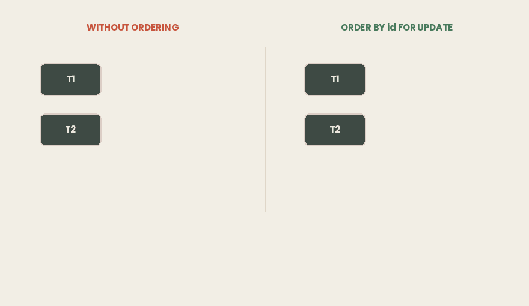

## TL;DR

- Two plain `UPDATE` statements are enough to deadlock. You do not have to write a single lock to get `40P01`.
- Table-level lock names are misleading: `ROW SHARE` and `ROW EXCLUSIVE` are **table** locks. Only the conflict list matters.
- **Only** `ACCESS EXCLUSIVE` **blocks a plain** `SELECT`**.** That is what makes `ALTER TABLE`, `DROP`, `TRUNCATE` and `VACUUM FULL` dangerous in production — and index builds safe, with `CONCURRENTLY`.
- Row locks have four modes on two axes: shared or exclusive, key-touching or not. The middle two exist so **foreign key checks do not block ordinary updates**.
- **Row locks never block readers.** Only another writer on the same row waits.
- The same `SELECT ... FOR UPDATE` behaves differently per isolation level: **Read Committed adapts, Repeatable Read gives up** with a serialization failure.
- Deadlock here is the same problem as in Java: **circular wait**, fixed the same way — a consistent lock order, which in SQL is `ORDER BY id FOR UPDATE`.
- **The victim is not random.** Each waiting session checks for a cycle exactly once, `deadlock_timeout` after it starts waiting, and whoever runs that check aborts itself. Too low a timeout and your check runs *before* the cycle exists: the same deadlock took 0.2 s or 10.0 s to detect, depending only on whose timer was set to what.
- **Advisory locks lock a number, not a row.** They are reentrant, and how many times a session holds one is invisible in `pg_locks`.
- A session-level advisory lock **survives** `ROLLBACK` **and survives being returned to a connection pool.** That is how "only one instance runs this job" fails silently.

> ***Environment for every output in this article:***
>
> - *Intel Core i7–4700HQ (4 cores / 8 threads, x86–64), 16 GB DDR3–1600*
>
> - *Ubuntu 26.04*
>
> - *PostgreSQL 18.6 with* `autovacuum` *off .*
>
> *Every SQL scenario below is in the* ***article-examples*** *repository, under* `postgres-explicit-locking/`*, with the steps numbered so you can run them yourself in two or three psql sessions.*
>
> *Source: [*[*github.com/…*](https://github.com/mryakar/article-examples/tree/master/postgres-explicit-locking)*]*

## The Deadlock You Did Not Ask For

Two accounts, two transactions, money moving in both directions.

```sql
-- T1                                    -- T2
BEGIN;                                   BEGIN;
UPDATE ... SET balance-100 WHERE id=100;
                                         UPDATE ... SET balance-100 WHERE id=200;
UPDATE ... SET balance+100 WHERE id=200;  -- waits
                                         UPDATE ... SET balance+100 WHERE id=100;
```

No `LOCK TABLE`, no explicit lock statement of any kind — four ordinary `UPDATE`s. T1's second statement blocks. Then T2 runs its second, and the database answers:

```bash
ERROR:  40P01: deadlock detected
DETAIL:  Process 1583 waits for ShareLock on transaction 760; blocked by process 1584.
         Process 1584 waits for ShareLock on transaction 761; blocked by process 1583.
HINT:  See server log for query details.
CONTEXT:  while updating tuple (0,1) in relation "accounts"
```

T2 is aborted. T1 wakes up, finishes, and commits — `100 | Ali | 900.00`, `200 | Ayşe | 1100.00`.

Nobody asked for a lock. Postgres took them anyway.

### In short

- Two `UPDATE`s on two rows, in opposite order, are enough to deadlock.
- No explicit lock was written anywhere in the code.
- Postgres detected the cycle and aborted one transaction with `40P01`; the other committed.
- Which one dies, and why, comes later.

## The Locks You Take Without Asking

The names are misleading: `ROW SHARE` and `ROW EXCLUSIVE` are **table-level** locks. The documentation says so directly — *"all of these lock modes are table-level locks, even if the name contains the word row; the names of the lock modes are historical."* They also have no behavior of their own. A mode is only a **list of modes it conflicts with**: two transactions cannot hold conflicting modes on the same table at once, and everything else runs.

```
lock mode                taken by
-----------------------  -------------------------------------------
ACCESS SHARE             SELECT
ROW SHARE                SELECT ... FOR UPDATE / FOR SHARE
ROW EXCLUSIVE            INSERT, UPDATE, DELETE
SHARE UPDATE EXCLUSIVE   VACUUM, ANALYZE, CREATE INDEX CONCURRENTLY
SHARE                    CREATE INDEX
SHARE ROW EXCLUSIVE      CREATE TRIGGER
EXCLUSIVE                REFRESH MATERIALIZED VIEW CONCURRENTLY
ACCESS EXCLUSIVE         DROP, TRUNCATE, VACUUM FULL, most ALTER TABLE
```

The top three do not conflict with each other, so readers, inserters and updaters never queue at the table level; when two of them do wait, it is over a **row**. At the other end of the list, `ACCESS EXCLUSIVE` **is the only mode that blocks a plain** `SELECT`**:**

```sql
T1: BEGIN; LOCK TABLE accounts IN ROW EXCLUSIVE MODE;
T2: SELECT count(*) FROM accounts;      -- does not wait
T2: INSERT INTO accounts ...;           -- does not wait

T1: BEGIN; LOCK TABLE accounts IN ACCESS EXCLUSIVE MODE;
T2: SELECT count(*) FROM accounts;      -- BLOCKED
```

That second block is what makes migrations risky: the statement may be fast, but it must acquire the lock first, and while it waits behind one long-running query every new `SELECT` queues behind it. Index builds show both sides — `CREATE INDEX` takes `SHARE` and stops writes; `CREATE INDEX CONCURRENTLY` takes `SHARE UPDATE EXCLUSIVE` and does not, at the cost of two table scans and no transaction block.

One property matters for two later sections: **a lock is held until the transaction ends**, never released early.

### In short

- Every statement takes a table-level lock, asked for or not.
- The names are historical: `ROW EXCLUSIVE` is a table lock.
- A lock mode has no behavior of its own — only a conflict list.
- `SELECT`, `INSERT` and `UPDATE` do not conflict at the table level.
- Only `ACCESS EXCLUSIVE` blocks a plain `SELECT`. That is what makes DDL dangerous.

## Reserving a Row: FOR UPDATE and Its Three Siblings

`SELECT ... FOR UPDATE` means: I am reading this row, I will write based on what I read, and nobody may change it in between. It is the lock for check-then-act logic. There are four such modes, on two axes — shared or exclusive, touching the key or not.

```
            mode                what it reserves
            ------------------  ------------------------------------
shared      FOR KEY SHARE       only the key: no change, no delete
            FOR SHARE           the whole row, while I read it

exclusive   FOR NO KEY UPDATE   the row, except its key
            FOR UPDATE          the whole row
```

Two shared modes coexist; an exclusive mode coexists with nothing. `FOR UPDATE` conflicts with all four, `FOR KEY SHARE` only with `FOR UPDATE`.

One cost before using `FOR UPDATE` over a large result set: a row lock is not kept in memory. It is **written into the tuple**, in the `xmax` field that an `UPDATE` or `DELETE` also writes. A million locked rows means a million tuple writes, each one WAL traffic and later vacuum work; there is no lock-table limit to hit because the locks are on disk. This also answers something the previous article left open — a non-zero `xmax` can mean the row is only locked, not deleted.

### In short

- Four modes on two axes: shared or exclusive, key-touching or not.
- Two shared modes coexist; an exclusive mode coexists with nothing.
- `FOR UPDATE` is the one for check-then-act logic.
- A row lock is written into the tuple’s `xmax`, so a million rows cost a million writes.

## Why the Middle Modes Exist

`FOR KEY SHARE` and `FOR NO KEY UPDATE` exist because of **foreign keys**. Three transactions on a `customers` table and its child `orders`:

```sql
T1: BEGIN; INSERT INTO orders(customer_id, amount) VALUES (42, 100);
    -- the FK check takes FOR KEY SHARE on customers(42)
T2: BEGIN; UPDATE customers SET name = 'Ali Veli' WHERE id = 42;
    -- name is not a key -> FOR NO KEY UPDATE -> does NOT wait
T3: BEGIN; DELETE FROM customers WHERE id = 42;
    -- DELETE always takes FOR UPDATE -> WAITS
```

T2 does not wait, T3 does, and the only difference is which mode each one needs. Postgres chooses the mode by looking at what you touched: a foreign key check takes `FOR KEY SHARE` on the parent row, an `UPDATE` takes `FOR UPDATE` if it touches a key column and `FOR NO KEY UPDATE` if it does not, and a `DELETE` always takes `FOR UPDATE`.

Without the middle modes a foreign key check would have to take the exclusive one. Every `INSERT` into `orders` would lock the customer row, and every request renaming that customer would queue behind it — a bottleneck built into the schema for any row many children point to.

### In short

- The middle modes exist so foreign key checks do not block ordinary updates.
- An `INSERT` into a child table takes `FOR KEY SHARE` on the parent row.
- A non-key `UPDATE` takes `FOR NO KEY UPDATE` and does not conflict with it.
- `DELETE` always takes `FOR UPDATE` and does conflict.
- Postgres picks the mode from the columns you touch.

## Row Locks Do Not Block Readers

T1 locks row 100 and holds it. T2 then tries four things:

```sql
T2: SELECT * FROM accounts WHERE id = 100;     -- does not wait, returns 1000.00
T2: SELECT count(*) FROM accounts;             -- does not wait
T2: UPDATE accounts SET ... WHERE id = 200;    -- does not wait
T2: UPDATE accounts SET ... WHERE id = 100;    -- BLOCKED
```

Three out of four do not wait. The locked row is still readable, as the last committed version — MVCC, as described in the previous article. A lock reserves the row for *writing*, so only the fourth statement waits.

Lock granularity is therefore contention granularity. In a table of a million accounts, holding row 100 affects transactions touching row 100 and nothing else: two payments from the same account are serialized, which correctness requires, and two payments from different accounts never meet.

### In short

- A row locked `FOR UPDATE` is still readable by any plain `SELECT`, with no wait.
- Full scans are unaffected; only a writer on the same row waits.
- Lock granularity is contention granularity: different customers never touch.

## FOR UPDATE Across Isolation Levels

The waiting is identical at all three levels. The difference appears *after* the other transaction commits. T1 reads a balance of 1000.00 and holds its snapshot, T2 changes that row to 500.00 and commits, and T1 then runs `SELECT ... FOR UPDATE` on it:

```
Read Committed    500.00, no error
Repeatable Read   ERROR:  could not serialize access
Serializable      ERROR:  could not serialize access
```

The full message in both error cases is `could not serialize access due to concurrent update`.

Read Committed **adapts**: it waits for the winner, then locks the *new* version and re-evaluates the `WHERE` clause against it. Repeatable Read **gives up**, because its snapshot is frozen for the whole transaction and the row it is handed is not the row it agreed to see.

This is the locking side of a behavior the previous article showed from the other direction: at Read Committed an `UPDATE ... WHERE balance > 500` that loses a race re-checks its condition and skips the row silently if it no longer qualifies, reported only as `UPDATE 0`. `FOR UPDATE` prevents that. Under Serializable the reverse holds — it is usually unnecessary, because SSI already tracks the read-write dependencies, and adding locks on top gives you the waiting *and* the retries.

### In short

- All three levels wait the same way; they differ after the winner commits.
- Read Committed locks the new version and re-evaluates `WHERE`. No error.
- Repeatable Read and Serializable raise a serialization failure. You must retry.
- Pick one: pessimistic locking at Read Committed, or optimistic retry at Serializable.

## The Same Problem: Circular Wait

Now the answer to the opening. The two transactions took row locks in opposite order: T1 locked row 100 and then wanted row 200, T2 locked row 200 and then wanted row 100. Each holds what the other needs, and neither can release early, because a row lock lives until the end of its transaction.


*Neither transaction mentions a lock. The* `UPDATE` *statements took them, and the order they took them in is the bug.*

This is the same failure as two Java threads calling `synchronized` on two accounts in opposite order: same cycle, same four conditions, same fix. Deadlock is a **resource ordering** problem, not a database or language problem. What differs is the response — PostgreSQL detects the cycle and aborts a participant, while the JVM detects it, prints it in a thread dump, and does nothing.

**Ordering removes it.** Lock the rows in a fixed order, in one statement:

```sql
SELECT id FROM accounts WHERE id IN (100, 200) ORDER BY id FOR UPDATE;
```

Both transactions now acquire in the same direction, and the second blocks at row 100 **while holding nothing**:



*The loser waits at the first row. There is no second edge for a cycle to close on.*

That is structural, not statistical: a transaction that holds nothing cannot be waited on, so the wait-for graph cannot contain a cycle.

**The first surprise: ordering is not always enough.** Two transactions read the same row with `FOR SHARE` — no conflict, both succeed. Then both try to upgrade to `FOR UPDATE`, and each waits for the other's shared lock:

```bash
ERROR:  deadlock detected
CONTEXT:  while locking tuple (0,1) in relation "accounts"
```

One row, same order, deadlock anyway. There is nothing to order, so the fix is the mode: **take the most restrictive lock you will need, the first time you touch the row.** Note the `CONTEXT` line too — the opening deadlock said `while updating tuple`, this one says `while locking tuple`, which tells you whether the collision was a plain write or an explicit lock request.

**The second surprise: the victim is not random.** The usual advice is that you cannot predict which transaction is aborted, and the documentation agrees: the outcome *“is difficult to predict and should not be relied upon.”* The advice is right; the explanation behind it is usually missing.

`deadlock_timeout` is a **per-session** setting. A session that starts waiting arms a timer. When it fires, that session walks the wait-for graph, and **if it finds a cycle it aborts itself**. The server does not choose among candidates: the victim is whichever session ran its check while the cycle existed.

Three cases, five runs each, same deadlock every time:

```
deadlock_timeout       cycle forms          victim      detected in
T1        T2
--------  --------     ------------------   ---------   -----------
200 ms    10 s         before T1's check    T1   5/5     0.2 s
10 s      200 ms       before T2's check    T2   5/5     0.2 s
200 ms    10 s         AFTER  T1's check    T2   5/5    10.0 s
```

In the third case T1 has the 200 ms timer and is *not* the one that notices. Its check ran at 200 ms, found no cycle because the cycle did not exist yet, and never ran again; the deadlock formed at 300 ms and held both transactions until T2’s ten-second timer fired.

Each waiter checks **exactly once** per wait. The source shows it: `ProcSleep` arms `DEADLOCK_TIMEOUT` once before the wait loop and never re-arms it, and inside the loop `CheckDeadLock` runs and the flag is cleared. The reason is cost — *"by delaying the check until we've waited for a bit, we can avoid running the rather expensive deadlock-check code in most cases."*

So **lowering** `deadlock_timeout` **can make detection later, not sooner.** Your application does not change either way: catch the error and retry from the beginning, with `40001` and `40P01` on the retry list.

### In short

- The opening deadlock came from taking two row locks in opposite order — circular wait, the same failure as two Java threads locking two accounts.
- Lock ordering removes it structurally: the waiter waits holding nothing.
- It does not help when both transactions upgrade a shared lock on the same row. Take the most restrictive mode up front.
- The victim is whichever session runs its check while the cycle exists. Lowering `deadlock_timeout` can delay detection — 10.0 s instead of 0.2 s.

## Locking a Number, Not a Row

Everything so far locked data. Advisory locks lock a **number**: `SELECT pg_advisory_lock(42)`. There is no row 42 and no table 42 — only your application knows what 42 means, and Postgres enforces nothing.

They exist for one pattern: **only one instance in the cluster should do this.** The nightly batch, the outbox relay, the scheduled job that must not run twice. Flyway takes this kind of lock before migrating; ShedLock is built on it. The variant that matters is `pg_try_advisory_lock`, which returns immediately instead of queueing:

```sql
instance A:  SELECT pg_try_advisory_lock(42);   ->  t     -- runs the job
instance B:  SELECT pg_try_advisory_lock(42);   ->  f     -- skips, no wait
instance C:  SELECT pg_try_advisory_lock(42);   ->  f     -- skips, no wait
```

The obvious alternative, a `job_running` boolean, is worse on three counts: every set and unset writes a new row version and feeds bloat, it is slower, and a crash mid-job leaves the flag `true` forever. An advisory lock is released when its session ends.

There are two lifetimes:

```sql
pg_advisory_lock(n)             -- session level
   released by   explicit unlock, or the session ending
   ROLLBACK      no effect: you still hold it
   unlock        required; N acquires need N releases

pg_advisory_xact_lock(n)        -- transaction level
   released by   end of transaction, automatically
   ROLLBACK      releases it
   unlock        not available, not needed
```

The `ROLLBACK` row is measurable:

```sql
A: BEGIN; SELECT pg_advisory_lock(77); ROLLBACK;
A: SELECT count(*) FROM pg_locks WHERE locktype='advisory';   ->  1
B: SELECT pg_try_advisory_lock(77);                           ->  f

A: BEGIN; SELECT pg_advisory_xact_lock(88); ROLLBACK;
A: SELECT count(*) FROM pg_locks WHERE locktype='advisory';   ->  0
```

The transaction was rolled back; the session-level lock is still held. The documentation states it: session-level requests *“do not honor transaction semantics.”*

Two more properties matter for the next section. Advisory locks are **reentrant** — a session holding one always gets it again, even with others queued behind it, and each acquire needs its own release — and the count is **invisible**:

```sql
A: SELECT pg_try_advisory_lock(42);  -> t
A: SELECT pg_try_advisory_lock(42);  -> t        -- same session, again

A: SELECT locktype, objid, mode FROM pg_locks WHERE locktype='advisory';
    locktype | objid |     mode
   ----------+-------+---------------
    advisory |    42 | ExclusiveLock              -- ONE row

A: SELECT pg_advisory_unlock(42);    -> t
B: SELECT pg_try_advisory_lock(42);  -> f        -- still held
A: SELECT pg_advisory_unlock(42);    -> t
B: SELECT pg_try_advisory_lock(42);  -> t        -- now it is free
```

A lock held twice looks the same as a lock held once, and you cannot ask the database how many releases are outstanding.

Two limits from the documentation. Advisory locks share a fixed shared-memory pool with regular locks, sized by `max_locks_per_transaction` and `max_connections`, so one lock per user will eventually exhaust it and the server can then grant no lock at all. And in `SELECT pg_advisory_lock(id) FROM foo WHERE id > 12345 LIMIT 100` the `LIMIT` is not guaranteed to be applied before the function runs, so you can take locks you never intended and never release; put the `LIMIT` in a subquery. One related tool: an advisory lock means *one instance does this job*, while `SELECT ... FOR UPDATE SKIP LOCKED` means *one worker takes this item*.

### In short

- An advisory lock locks a number you choose; Postgres does not check what it means.
- Use `pg_try_advisory_lock` so losers skip the round instead of queueing.
- A session-level lock survives `ROLLBACK`. A transaction-level one does not.
- They are reentrant, and `pg_locks` never shows how many times one is held.
- Prefer `pg_advisory_xact_lock` unless the work spans more than one transaction.

## The Ghost Lock in Your Connection Pool

Combine the last two properties with a connection pool. A request takes a session-level advisory lock, does its work, and returns the connection — and in between the unlock is missed, through an early return, an exception, or a refactor that moved the release off the path.

```java
try (Connection c = pool.getConnection()) {
    if (tryAdvisoryLock(c, JOB_ID)) {
        runTheJob(c);
    }
}   // close() does NOT close the connection. It returns it to the pool.
```

HikariCP does clean up on return: it rolls back an open transaction and resets `autoCommit`, isolation and the read-only flag. What it does not reset is **session state** — it sends no `DISCARD ALL`, and the advisory lock is session state.

Three requests through a one-connection pool, against 18.6:

```sql
request #1 pid 2299  pg_try_advisory_lock(42) -> true  => RUNS THE JOB
request #2 pid 2299  pg_try_advisory_lock(42) -> true  => RUNS THE JOB
request #3 pid 2299  pg_try_advisory_lock(42) -> true  => RUNS THE JOB
round 1  pool OPEN    advisory lock rows: 1     (expected 1)
round 1  pool OPEN    outsider can take it: false (expected false)
round 1  pool CLOSED  advisory lock rows: 0     (expected 0)
```


*Same backend process for all three requests. The guard returns true every time, and one lock row on the server is all you can see.*

The damage runs in two directions. **Outward:** no other instance can take that lock, so the job they were all guarding stops running everywhere and nothing reports an error. **Inward:** the leaking instance passes its own guard — requests #2 and #3 got `true`, because advisory locks are reentrant and this is the same session. The "only one instance" check did not fail loudly; it returned true, and each call incremented a reference count that now needs three unlocks on a connection no request owns.

This is the same shape as a `ThreadLocal` left uncleared when a thread returns to its pool: a pooled resource carrying state that outlives the work it belonged to, inherited by the next unrelated task.

Diagnosis is difficult, because `pg_locks` shows one row whether the lock was taken once or three times. The last line above is the clearest signal: close the pool and the lock disappears, which shows it was tied to a session nobody was tracking.

The fix is to have no unlock at all. `pg_advisory_xact_lock` releases at the end of the transaction, on every path including the failing ones — the same three requests then return `true` each time, leave zero lock rows while the pool is open, and let an outsider take the lock. If the work really spans several transactions, the release belongs in a `finally`, with `DISCARD ALL` on connection return as a backstop.

### In short

- A session-level advisory lock is not released when the connection returns to the pool.
- The pool resets autocommit and isolation, not session state.
- Other instances are locked out, and the leaking instance passes its own guard, because the locks are reentrant.
- Same bug as a `ThreadLocal` left dirty on a pooled thread.
- Use transaction-level advisory locks unless the work spans several transactions.

## Reading pg_locks

When something is stuck, two views answer the question. Start with who is waiting:

```
 pid  |        state        | wait_event_type |  wait_event
------+---------------------+-----------------+---------------
 1790 | idle in transaction | Client          | ClientRead
 1792 | active              | Lock            | transactionid
```

Process 1792 is `active` with `wait_event_type = 'Lock'` — the victim. Process 1790 is `idle in transaction`: running no query, and the cause. That state is the most useful warning sign here, because no work is happening and locks are held anyway. Then the chain, from `pg_locks` joined to itself (the full query is in the repo; the two sides are aliased `waiting` and `blocking`):

```
 waiting | blocking | requested_mode | held_mode     |   locktype
---------+----------+----------------+---------------+---------------
    1792 |     1790 | ShareLock      | ExclusiveLock | transactionid
```

Note the `locktype`: it is not a row lock. A transaction waiting for a row is recorded as waiting on the **other transaction's id**, a `ShareLock` on `transactionid` that is granted when that transaction ends. This is why row waits never appear as rows in `pg_locks`.

You do not have to write the join:

```sql
SELECT pid, pg_blocking_pids(pid) AS blocking_pids
  FROM pg_stat_activity
 WHERE cardinality(pg_blocking_pids(pid)) > 0;
```

```
 pid  | blocking_pids
------+---------------
 1792 | {1790}
```

For advisory locks, `WHERE locktype = 'advisory'` lists them, with the earlier caveat: the row is there, the count is not.

**A lock wait is unbounded by default.** The documentation is explicit that a transaction seeking a lock “will wait indefinitely for conflicting locks to be released”, as long as no deadlock is detected. `lock_timeout` caps the waiting alone, `statement_timeout` caps the whole statement. Migrations want the first, so they fail fast instead of forming a queue behind a lock they cannot get.

### In short

- A waiting session shows `wait_event_type = 'Lock'`; the blocker shows `idle in transaction`.
- Row lock waits are recorded on `transactionid`, not on the row.
- `pg_blocking_pids()` gives you the chain in one call.
- `pg_locks` will not tell you how many times an advisory lock is held.
- Lock waits are unbounded by default. Set `lock_timeout`.

## Pessimistic or Optimistic — Pick One

There are two coherent strategies, and most of the trouble comes from running half of each.

**Pessimistic** is Read Committed, `SELECT ... FOR UPDATE`, and a consistent lock order. You wait, but the waiting is predictable and there are no serialization failures to handle. For a balance many transactions contend over, this is usually the right answer.

**Optimistic** is Serializable, no explicit locks, and a retry loop around `40001` and `40P01`. Nothing waits, but a hot row can produce many retries and every transaction must be safe to run twice. Serializable is the option when you cannot lock what you need to protect — an invariant across rows that do not exist yet, where predicate locks do work that `FOR UPDATE` cannot.

Mixing them pays both costs: you wait for locks *and* you handle serialization failures. Whichever you pick, keep transactions short, because every open transaction holds locks, widens the deadlock window and blocks cleanup.

There is a third option that belongs to neither column:

```sql
UPDATE accounts SET balance = ?, version = version + 1
 WHERE id = ? AND version = ?;
```

No lock anywhere. Read the row, compute the new value, and write it back **only if the version you read is still there**. If the update affects zero rows, somebody else got there first and you start over.

That is compare-and-set, written in SQL. Java has the same idea in hardware — and that is the next article.

### In short

- Pessimistic: Read Committed plus `FOR UPDATE` plus a lock order. Predictable waiting, no retries.
- Optimistic: Serializable plus a retry loop on `40001` and `40P01`. No waiting, retries mandatory.
- Mixing the two pays both costs. Keep transactions short either way.
- A version column gives you compare-and-set without any lock at all.

## References

**PostgreSQL documentation**

- *13.3 Explicit Locking*
 [https://www.postgresql.org/docs/18/explicit-locking.html](https://www.postgresql.org/docs/18/explicit-locking.html)
- *13.2 Transaction Isolation* 
 [https://www.postgresql.org/docs/18/transaction-iso.html](https://www.postgresql.org/docs/18/transaction-iso.html)
- *Lock Management* 
 [https://www.postgresql.org/docs/18/runtime-config-locks.html](https://www.postgresql.org/docs/18/runtime-config-locks.html)
- *Advisory Lock Functions (9.28.10)*
 [https://www.postgresql.org/docs/18/functions-admin.html](https://www.postgresql.org/docs/18/functions-admin.html)
- *pg_locks*
 [https://www.postgresql.org/docs/18/view-pg-locks.html](https://www.postgresql.org/docs/18/view-pg-locks.html)
- *SELECT — The Locking Clause* 
 [https://www.postgresql.org/docs/18/sql-select.html](https://www.postgresql.org/docs/18/sql-select.html)
