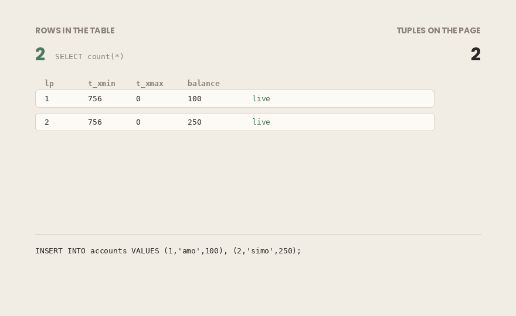
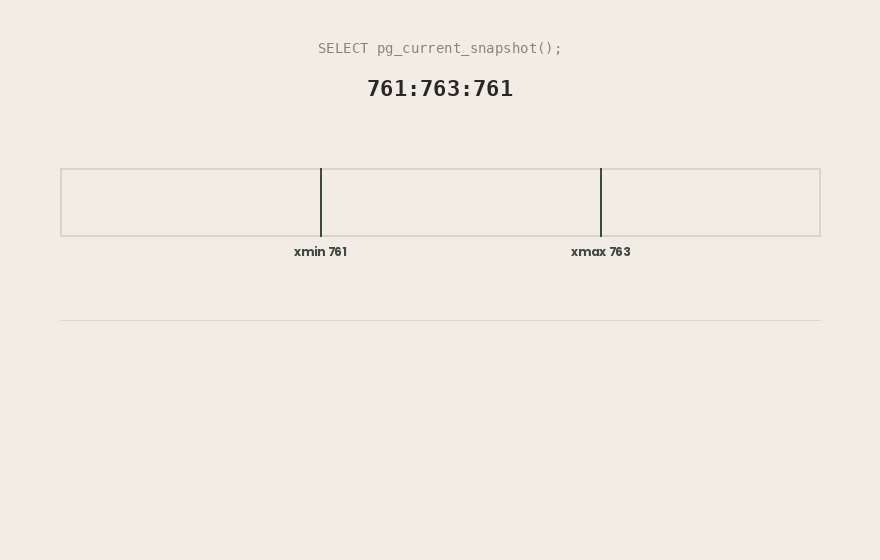
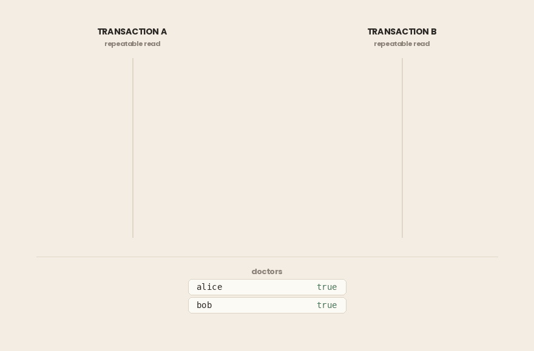

## TL;DR

- In PostgreSQL, `UPDATE` never changes a row in place. It writes a **new row version** and marks the old one dead. `DELETE` only marks. The number of rows in your table is not the number of tuples on disk.
- Every tuple carries `xmin` (the transaction that created it) and `xmax` (the transaction that killed or locked it). These two fields are the core of MVCC.
- A **snapshot** is three values: `xmin`, `xmax`, and the list of transaction ids that were still running when it was taken. Visibility is decided per tuple against that snapshot.
- Isolation levels are not separate features. They are **one engine with a different snapshot policy**.
- **Read Committed** takes a new snapshot for every statement. An `UPDATE` that waits for a conflict then re-checks its `WHERE` clause against the new version.
- **Repeatable Read** freezes one snapshot for the whole transaction. In PostgreSQL this prevents dirty reads, non-repeatable reads **and phantom reads** — stronger than the SQL standard requires. What remains is serialization anomalies.
- **Serializable** adds SSI: predicate locks track read/write dependencies and abort transactions that would produce a non-serializable outcome. This is what catches **write skew**.
- Under Repeatable Read and Serializable, `could not serialize access` is not a failure. It is part of the contract, and your application **must retry**, which makes idempotency mandatory.
- Old versions pile up. **VACUUM** reclaims them — unless an open transaction holds the xmin horizon back, in which case nothing can be cleaned.
- MVCC is not unique to PostgreSQL, but implementations differ. PostgreSQL keeps old versions in the table itself; Oracle and InnoDB keep them in undo segments. Lock-based systems (2PL) block readers against writers; MVCC does not.

> ***Environment for every output in this article:*** *PostgreSQL 18.6 (Debian build) on x86_64, running in Docker with* `autovacuum` *turned off so that nothing is cleaned up in the background while we are looking at it. Transaction ids on your machine will be different; the structure will not be.*

## From Anomalies to Mechanism

In an earlier article I described what can go wrong when transactions run at the same time: **dirty reads**, **non-repeatable reads**, and **phantom reads**, and which isolation level prevents each one. That article stayed at the level of behavior — what you see, and which setting changes it.

This one goes underneath. The question here is not *which anomalies does Repeatable Read prevent*, but *what is the database actually doing that makes them impossible*.

The answer is a single mechanism: **Multiversion Concurrency Control**. The three isolation levels PostgreSQL offers are not three different algorithms. They are the same engine with a different rule about when a snapshot is taken.

One correction before we start. In that earlier article I wrote that you must move to Serializable to prevent phantom reads. That is true of the SQL standard. It is **not** true of PostgreSQL, and we will see exactly why once the mechanism is on the table.

Nothing here touches Spring, `@Transactional`, or the application layer. Two `psql` sessions and a table.

### In short

- The earlier article described *which* anomalies each isolation level prevents. This one explains *how*.
- PostgreSQL’s three isolation levels are not three algorithms. They are one engine — **MVCC** — with different snapshot rules.
- Correction to that earlier article: in PostgreSQL you do **not** need Serializable to prevent phantom reads.

## UPDATE Does Not Update

Start with a table:

```sql
CREATE TABLE accounts (id int primary key, owner text, balance numeric); 

INSERT INTO accounts VALUES 
(1, 'amo', 100), 
(2, 'simo', 250);
```

Now change one row three times:

```sql
UPDATE accounts SET balance = 90 WHERE id = 1; 
UPDATE accounts SET balance = 80 WHERE id = 1; 
UPDATE accounts SET balance = 70 WHERE id = 1;
```

Two rows in, three updates applied. Ask the table how many rows it has:

```bash
visible_rows
--------------
            2
(1 row)
```

Now ask the *page* what it is holding. The `pageinspect` extension reads the raw heap:

```sql
CREATE EXTENSION IF NOT EXISTS pageinspect; 
SELECT lp, t_xmin, t_xmax, t_ctid 
FROM heap_page_items(get_raw_page('accounts', 0));
```

```bash
 lp | t_xmin | t_xmax | t_ctid
----+--------+--------+--------
  1 |    756 |    757 | (0,3)
  2 |    756 |      0 | (0,2)
  3 |    757 |    758 | (0,4)
  4 |    758 |    759 | (0,5)
  5 |    759 |      0 | (0,5)
(5 rows)
```



Five tuples on disk. Two rows in the table.

An `UPDATE` in PostgreSQL does not change a row. It writes a **new version** of that row and marks the old version as dead. `DELETE` does not remove anything either. It only marks. Every version that ever existed is still on the page until something comes along to clean it up.

This is the foundation of everything that follows. Two transactions can read the same row and see different values, and both are right. There is no single “current value” on disk. There is a set of versions, and each transaction is entitled to a different one.

### In short

- `UPDATE` writes a **new row version** and marks the old one dead. `DELETE` only marks.
- Three updates to one row leave **four versions** of it on the page. Two logical rows, five tuples on disk.
- There is no single “current value” stored anywhere. There is a set of versions.
- `pageinspect` lets you see the raw tuples: `heap_page_items(get_raw_page('accounts', 0))`.

## xmin and xmax: How a Row Version Is Marked

Every tuple carries two system columns you can query directly:

- `xmin` — the id of the transaction that created this version.
- `xmax` — the id of the transaction that marked it dead. `0` means still live.

Right after the insert:

```sql
SELECT xmin, xmax, ctid, * FROM accounts ORDER BY id;
```

```bash
 xmin | xmax | ctid  | id | owner | balance
------+------+-------+----+-------+---------
  756 |    0 | (0,1) |  1 | amo   |     100
  756 |    0 | (0,2) |  2 | simo  |     250
(2 rows)
```

Both rows were created by transaction 756, and nothing has killed them. After the three updates, row 1 looks like this:

```bash
 xmin | xmax | ctid  | id | owner | balance
------+------+-------+----+-------+---------
  759 |    0 | (0,5) |  1 | amo   |      70
  756 |    0 | (0,2) |  2 | simo  |     250
(2 rows)
```

Row 1 is now the version created by transaction 759. Compare this with the raw page output above and you can follow the chain: version 1 was killed by 757, which created version 3, which was killed by 758, which created version 4, and so on. `ctid` is the physical address of a version — page number and item number.

**One thing that will confuse you at the terminal.** A non-zero `xmax` does not always mean the row was deleted or updated. It is also set when a row is only **locked**:

```sql
-- session B
BEGIN;
SELECT id FROM accounts WHERE id = 1 FOR UPDATE;
```

```bash
 xmin | xmax | ctid  | id | balance
------+------+-------+----+---------
  759 |  760 | (0,5) |  1 |      70
  756 |    0 | (0,2) |  2 |     250
(2 rows)
```

Transaction 760 has not written anything. It holds a lock. The row is alive and stays alive.

The tuple header knows the difference, and it will tell you. The `HEAP_XMAX_LOCK_ONLY` flag is bit 128 of `t_infomask`:

```sql
SELECT lp, t_xmax, (t_infomask & 128) != 0 AS xmax_is_lock_only
FROM heap_page_items(get_raw_page('accounts', 0))
WHERE lp = 5;
```

```bash
 lp | t_xmax | xmax_is_lock_only
----+--------+-------------------
  5 |    760 | t
(1 row)
```

So do not read `xmax` as "this version is dead". The flag bits carry that distinction, not `xmax` on its own.

### In short

- `xmin` = the transaction that created this version. `xmax` = the transaction that killed or locked it; `0` means live.
- Both are system columns you can query. `ctid` is the version's physical address (page, item).
- **A non-zero** `xmax` **does not mean deleted.** `SELECT ... FOR UPDATE` also sets it. The `HEAP_XMAX_LOCK_ONLY` flag in `t_infomask` carries the difference, not `xmax` alone.

## Snapshots and the Visibility Rule

A transaction does not see the newest version of a row. It sees the version its **snapshot** allows it to see.

A snapshot is three values, and PostgreSQL will show them to you:

```sql
SELECT pg_current_snapshot();
```

```bash
 pg_current_snapshot
---------------------
 761:763:761
(1 row)
```

Read as `xmin:xmax:xip_list`:

- `xmin` **= 761** — every transaction below this id has finished. No need to check them one by one.
- `xmax` **= 763** — every transaction from this id upward had not started when the snapshot was taken. Automatically invisible.
- `xip_list` **= 761** — transactions between `xmin` and `xmax` that were **still running**. Their work stays invisible even if they commit one microsecond later.

Only the middle range needs a list. That is why `xip_list` is often empty. If the running transactions all have ids at or above `xmax`, the second rule already excludes them.



Now the rule that decides every read. For a tuple to be visible:

1. Its `xmin` **must have committed**, and the snapshot must not exclude it — not in `xip_list`, not at or above `xmax`.
2. Its `xmax` **must not disqualify it** — either empty, or belonging to a transaction that has not committed, or one the snapshot excludes.

Both conditions, per tuple, on every read. That is the whole of MVCC visibility.

One detail is missing, and it matters. Nothing in the tuple says whether transaction 757 committed. The tuple stores an id. The commit status lives in the **commit log** (`pg_xact`). Checking it on every read would be expensive, so PostgreSQL writes the answer back into the tuple as **hint bits** the first time someone asks. This is why the first `SELECT` after a write can be slower than the second one on the same data.

The mechanism is now complete: versions marked with `xmin` and `xmax`, and a snapshot that decides which ones you are allowed to see.

What we have not said is **when** the snapshot is taken. That single question is the difference between the isolation levels.

### In short

- A snapshot is three values: `xmin:xmax:xip_list`. Everything below `xmin` finished; everything at or above `xmax` had not started; `xip_list` holds the ones in between that were still running.
- A tuple is visible when its `xmin` **committed and the snapshot does not exclude it**, **and** its `xmax` **does not disqualify it**.
- `xip_list` is often empty. That is normal — running transactions at or above `xmax` are already excluded by the second rule.
- Commit status is not in the tuple. It lives in `pg_xact`, cached back as **hint bits**, which is why the first read after a write can be slower.

## Not Just Postgres: The Two Families of Concurrency Control

Before we look at the three isolation levels, one step back. MVCC is not a PostgreSQL invention, and knowing where it sits helps you read the levels correctly.

Databases solve concurrent access in one of two broad ways.

**The lock-based family.** Under **two-phase locking (2PL)**, a transaction takes a shared lock to read and an exclusive lock to write, and holds them until it ends. The rule is simple and the cost is high: **a reader blocks a writer, and a writer blocks a reader.** Correctness comes from making conflicting transactions wait for each other.

**The multiversion family.** Under MVCC, a write does not destroy what a reader is using, because the old version is still there. So **readers do not block writers, and writers do not block readers.** In plain MVCC, two transactions conflict only when both want to write the same row.

That is the whole reason MVCC won for OLTP workloads. A long report can scan a table while updates continue around it, and neither side waits.

But **MVCC is a strategy, not a specification**. Systems that all claim MVCC differ in the part that matters most — where the old versions are kept.

- **PostgreSQL** keeps old versions **in the table itself**. That is what you saw on the page: five tuples for two rows. Cheap to write, and the reason PostgreSQL needs **VACUUM**.
- **Oracle** and **MySQL/InnoDB** keep old versions in **undo segments**, separate from the table, and rebuild earlier versions on demand. No VACUUM, but a long read can outlive the undo it needs — Oracle’s `ORA-01555: snapshot too old` is exactly that failure.
- **SQL Server** uses locking by default and switches to versioning only when you turn on snapshot isolation.
- **CockroachDB** and **YugabyteDB** apply MVCC across a distributed cluster, where version timestamps also have to survive clock differences between machines.

At the far end there is a third answer: **do not run transactions at the same time at all.** VoltDB runs them one after another on single-threaded partitions. Correct by design, and only practical when transactions are short.

Why this matters for the rest of the article: everything from here on is **PostgreSQL’s** implementation. The isolation level names are standard. The behavior behind them is not.

### In short

- Two families: **lock-based (2PL)**, where readers and writers block each other, and **multiversion (MVCC)**, where they do not.
- MVCC is a strategy, not a single design. Where old versions live is the main difference between implementations.
- PostgreSQL stores old versions **in the table**, which is why it needs VACUUM. Oracle and InnoDB use **undo segments** instead.
- The isolation level names in the SQL standard are shared. The behavior behind them is per-database.

## Read Committed: A New Snapshot for Every Statement

This is PostgreSQL’s default level, and its rule is one sentence: **every statement takes a fresh snapshot.**

Which means two identical `SELECT`s in the same transaction can return different answers.

```sql
-- session A
BEGIN ISOLATION LEVEL READ COMMITTED;
SELECT balance FROM accounts WHERE id = 1;
```

```bash
balance
---------
      70
(1 row)
```

```sql
-- session B
UPDATE accounts SET balance = 999 WHERE id = 1;
COMMIT;
```

```sql
-- session A, same transaction
SELECT balance FROM accounts WHERE id = 1;
```

```bash
balance
---------
     999
(1 row)
```

Nothing is broken. A’s second statement asked for a new snapshot, and by then B’s transaction had committed and was therefore visible. This is the **non-repeatable read** from the earlier article, now with a mechanism behind it: not a race, not a bug — a new snapshot.

**The part almost every article skips.**

Statement-level snapshots explain reads. Writes need one more rule, because a writer cannot simply ignore a concurrent change to the row it is about to modify.

When an `UPDATE` reaches a row that another uncommitted transaction has already modified, it **waits**. If that transaction rolls back, the update goes ahead normally. If it commits, PostgreSQL does something you have to see to believe: it **re-checks the** `WHERE` **clause against the new version**.

```sql
-- balance is 1000
-- session A
BEGIN;
UPDATE accounts SET balance = 5 WHERE id = 1;   -- not committed yet
```

```sql
-- session B
BEGIN;
UPDATE accounts SET balance = balance - 100 WHERE balance > 500;
-- blocks, waiting for A
```

Session A commits. B wakes up and checks its condition again against the row as it now stands. `balance` is 5, and `5 > 500` is false:

```bash
UPDATE 0
```

The row matched when B started and does not match anymore, so B skips it. **No error, no warning, zero rows updated.** If your code assumed the update applied, it is now wrong and silent.

This is the strongest argument for `WHERE` clauses that do not depend on values you are also changing — and, when correctness matters more than throughput, for a stricter isolation level.

### In short

- Read Committed takes a **new snapshot for every statement**, not for every transaction.
- Two identical `SELECT`s in one transaction can return different values. That is the level working as designed.
- An `UPDATE` blocked by a concurrent write **waits, then re-checks its** `WHERE` **clause** against the new version.
- If the row no longer matches, it is skipped silently — `UPDATE 0`, no error.

## Repeatable Read: One Snapshot to Rule the Transaction

Change one word and the mechanism changes completely. Under Repeatable Read, the snapshot is taken **once**, at the first statement of the transaction, and never refreshed.

```sql
-- session A
BEGIN ISOLATION LEVEL REPEATABLE READ;
SELECT count(*) FROM accounts;           -- 2
SELECT balance FROM accounts WHERE id = 1;  -- 100
```

```sql
-- session B
INSERT INTO accounts VALUES (3, 'new', 500);
UPDATE accounts SET balance = 777 WHERE id = 1;
-- both committed
```

```sql
-- session A, same transaction
SELECT count(*) FROM accounts;
SELECT balance FROM accounts WHERE id = 1;
```

```bash
 count
-------
     2
(1 row)

 balance
---------
     100
(1 row)
```

B’s work is committed and permanent. A cannot see it and will not see it until A ends. The snapshot is frozen.

**Here is the correction I owe the earlier article.**

Look at that `count(*)` again. B inserted a row that matches A's query, and A's second count still returns 2. That is a **phantom read**, and it did not happen.

In the SQL standard, Repeatable Read is allowed to permit phantom reads, and preventing them is the job of Serializable. That is what I wrote before, and it is what most articles repeat. **In PostgreSQL it is wrong.** Visibility here is decided by a frozen snapshot, not by row locks. A row created after the snapshot is invisible no matter how many times you look — as a row, and inside an aggregate.

The official documentation is explicit: PostgreSQL’s Repeatable Read prevents every phenomenon in the standard’s table except serialization anomalies. The standard sets a **minimum**. Giving more is allowed.

**What freezing costs you.**

A frozen snapshot is fine while you are reading. Writing is where it gets interesting, because a transaction cannot modify a row version it is not allowed to see.

```sql
-- session A                      -- session B
BEGIN ISOLATION LEVEL REPEATABLE READ;
UPDATE accounts
  SET balance = 200 WHERE id = 1;
                                  BEGIN ISOLATION LEVEL REPEATABLE READ;
                                  UPDATE accounts
                                    SET balance = 300 WHERE id = 1;
                                  -- blocks
COMMIT;
```

```bash
ERROR:  could not serialize access due to concurrent update
```

Compare this with Read Committed, where B waited and then quietly applied its update to the new version. Repeatable Read refuses. B’s snapshot says `balance` is 100. The row on disk says something else. There is no honest way to go on, so the transaction is aborted.

**This is not a bug and not a deadlock.** It is the level telling you it could not keep its promise, and handing the decision back to your application. Which raises a question we will have to answer properly: what is your code supposed to do with that error?

### In short

- Repeatable Read takes **one snapshot** at the first statement and keeps it for the whole transaction.
- Committed changes from other transactions stay invisible until yours ends.
- **PostgreSQL’s Repeatable Read also prevents phantom reads** — stronger than the SQL standard requires. Only serialization anomalies remain.
- A conflicting write does not wait and retry. It fails with `could not serialize access due to concurrent update`.

## Serializable: When Snapshots Aren’t Enough

A frozen snapshot prevents every anomaly built on *reading the wrong version*. There is a class of bug it cannot touch, because nothing is read wrongly at all.

Two doctors are on call. The rule: at least one must stay.

```sql
CREATE TABLE doctors (name text primary key, on_call boolean);
INSERT INTO doctors VALUES ('alice', true), ('bob', true);
```

Both want to go home, at the same time, under **Repeatable Read**:

```sql
-- session A                        -- session B
BEGIN ISOLATION LEVEL REPEATABLE READ;
SELECT count(*) FROM doctors
  WHERE on_call;              -- 2
                                    BEGIN ISOLATION LEVEL REPEATABLE READ;
                                    SELECT count(*) FROM doctors
                                      WHERE on_call;              -- 2
UPDATE doctors SET on_call = false
  WHERE name = 'alice';
                                    UPDATE doctors SET on_call = false
                                      WHERE name = 'bob';
COMMIT;
                                    COMMIT;
```

Both commit. No error. Now look at the table:

```bash
name  | on_call
-------+---------
 alice | f
 bob   | f
(2 rows)
```

Nobody is on call.



**Every step was legal.** Each transaction read a correct snapshot, checked the rule, saw two doctors, and removed one. They wrote to **different rows**, so there was no write conflict for MVCC to detect. Each transaction is correct on its own, and the pair is not.

This is **write skew**, and it is the anomaly that snapshot isolation cannot see. The reason is structural. MVCC detects conflicts between **writes**. Here the conflict is between what one transaction **read** and what the other **wrote**.

`SELECT ... FOR UPDATE` would fix this particular case by locking the rows that were read. But that requires you to spot the problem first, in every place it can happen.

**What Serializable adds.**

PostgreSQL’s Serializable uses **SSI — Serializable Snapshot Isolation**. It keeps the snapshot machinery and adds tracking on top. When a transaction reads, PostgreSQL records what it read, including conditions and not only rows. That record is a **predicate lock**, held as an `SIREAD` lock, and it blocks nothing.

With that information, PostgreSQL watches for **read/write dependencies**: transaction B wrote something A had read. One such dependency is harmless. A specific pattern of them — one transaction sitting between two others in a way no serial order could produce — is not. When PostgreSQL sees that pattern, it aborts one of the transactions.

Same scenario, one word changed:

```sql
BEGIN ISOLATION LEVEL SERIALIZABLE;
```

```bash
ERROR:  could not serialize access due to read/write dependencies among transactions
DETAIL:  Reason code: Canceled on identification as a pivot, during commit attempt.
HINT:  The transaction might succeed if retried.
```

Read that error carefully. It is not about the row B wrote. It is about the **dependency between what B read and what A wrote** — a conflict with no locking, no waiting, and no blocking anywhere in the sequence. The database let both transactions run at full speed and only refused at the end, when it could prove the outcome was not serializable.

Note the word **pivot**. B is the transaction in the middle of the dangerous pattern, and PostgreSQL cancels the pivot rather than the first or last participant.

And the rule survives:

```bash
name  | on_call
-------+---------
 alice | f
 bob   | t
(2 rows)
```

Alice went home. Bob was rolled back and is still on call. Same two transactions, same order, one different keyword.

Serializable is not free. Tracking reads costs memory, and under contention it produces more aborts. But it gives you a guarantee no other level does: **if your transaction is correct when it runs alone, it is correct when it runs alongside others.** You stop reasoning about interleavings.

There is a condition attached, and it is not optional. That `HINT` says the transaction might succeed if retried — which means somebody has to retry it.

### In short

- Repeatable Read prevents anomalies caused by reading a stale version. **Write skew is not one of them.**
- Two transactions can read the same condition, write **different rows**, both commit, and break an invariant together.
- MVCC detects **write/write** conflicts. Write skew is a **read/write** conflict, which is invisible to it.
- Serializable adds **SSI**: predicate locks record what was read, and dangerous dependency patterns cause an abort at commit time.
- The abort is the mechanism working, not failing — and it assumes your application retries.

## You Must Retry. There Is No Way Around It.

Both stricter isolation levels can end your transaction with an error you did not cause:

```bash
ERROR:  could not serialize access due to concurrent update
ERROR:  could not serialize access due to read/write dependencies among transactions
HINT:  The transaction might succeed if retried.
```

Treating these as failures is the most common mistake made with Repeatable Read and Serializable. **They are not failures. They are part of the contract.**

The deal PostgreSQL offers is this: run at full speed with no blocking, and in exchange, accept that some transactions will be told to start over. You cannot take the first half without the second. A system that uses Serializable and does not retry has taken the cost and refused the benefit.

**Which errors to retry.**

Retry only on **SQLSTATE 40001** (`serialization_failure`) and **40P01** (`deadlock_detected`). Both mean the same thing in practice: nothing was written, the transaction rolled back cleanly, and running it again may work.

Do not retry on constraint violations, syntax errors, or connection failures. Those will fail again.

```java
int attempt = 0;
while (true) {
    try {
        return doTransaction();
    } catch (SQLException e) {
        String state = e.getSQLState();
        if (!("40001".equals(state) 
        || "40P01".equals(state)) 
        || ++attempt >= MAX) {
            throw e;
        }
        Thread.sleep(backoffWithJitter(attempt));
    }
}
```

Three details in that loop matter.

**The retry must be outside the transaction.** A rolled-back transaction cannot be resumed. Everything the transaction did — including anything your application changed in memory — has to be redone from the start.

**Back off, and add jitter.** Two transactions that conflicted once will conflict again if they both retry immediately. Without random jitter, retries line up and the contention gets worse.

**Cap the attempts.** An endless retry loop turns a temporary conflict into an outage.

**The part that is easy to get wrong.**

Retrying means the transaction body may run more than once. That is safe for database work, because the rollback undid it. It is not safe for anything else your code does inside that block.

Sending an email, calling a payment API, publishing to Kafka, writing a file, increasing a counter in memory — PostgreSQL rolls back none of these. Retry the transaction three times and you may charge a customer three times.

So the rule is: **the transaction body must be idempotent, or it must contain nothing but database work.** Side effects belong outside the retry boundary, or behind an idempotency key, or in an outbox table written inside the same transaction and processed afterwards.

**Read Committed does not let you off.** It avoids serialization failures for reads, but a deadlock between two transactions taking locks in different orders can happen at any isolation level, and that is `40P01`. Retry logic is not a Serializable-only concern.

### In short

- `40001` and `40P01` are **expected outcomes**, not bugs. They mean the transaction rolled back cleanly and can be run again.
- Retry only those two SQLSTATEs. Constraint violations and syntax errors will fail again.
- The retry must wrap the **whole** transaction, with backoff, **jitter**, and a maximum attempt count.
- The transaction body will run more than once. Non-database side effects — emails, payments, message publishing — must be **idempotent** or moved outside the retry boundary.

## The Bill: Dead Tuples, Bloat, and VACUUM

MVCC’s advantage is that writers never block readers. The price is that every update leaves a corpse behind, and somebody has to bury it.

That somebody is **VACUUM**.

Fifty thousand rows, updated once:

```sql
CREATE TABLE bloat (id int primary key, v int);
INSERT INTO bloat SELECT g, g FROM generate_series(1, 50000) g;
UPDATE bloat SET v = v + 1;
```

```sql
SELECT n_live_tup, n_dead_tup FROM pg_stat_user_tables WHERE relname = 'bloat';
```

```bash
n_live_tup | n_dead_tup
------------+------------
      50000 |      50000
(1 row)
```

Fifty thousand live rows, fifty thousand dead versions, all in the same table. This is **bloat**: pages your queries still have to read past, and disk you are still paying for.

If that query returns zeros at first, wait a second and run it again. Table statistics are flushed with a short delay, not on every write.

VACUUM finds those dead tuples and marks their space reusable. **Autovacuum** does this in the background. By default it starts when the number of dead tuples passes 20% of the table plus 50 rows.

**The failure mode you will actually hit.**

VACUUM cannot remove a dead tuple that some open transaction might still need. The oldest transaction in the system sets a floor — the **xmin horizon** — and nothing above it can be cleaned.

Open a transaction, take a snapshot, then update every row from somewhere else:

```sql
-- session A
BEGIN ISOLATION LEVEL REPEATABLE READ;
SELECT count(*) FROM bloat;    -- snapshot taken here
-- and then A just sits there
```

```sql
-- elsewhere
UPDATE bloat SET v = v + 1;
VACUUM (VERBOSE) bloat;
```

```bash
INFO:  vacuuming "mvcc.public.bloat"
INFO:  finished vacuuming "mvcc.public.bloat": index scans: 1
pages: 0 removed, 664 remain, 664 scanned (100.00% of total), 0 eagerly scanned
tuples: 0 removed, 100000 remain, 50000 are dead but not yet removable
removable cutoff: 784, which was 1 XIDs old when operation ended
```

**Zero removed.** Fifty thousand tuples are dead, VACUUM found all of them, and it is not allowed to touch a single one — because session A’s snapshot might still need them.


You can see who is holding the line:

```sql
SELECT pid, backend_xid, backend_xmin, now() - xact_start AS age
FROM pg_stat_activity
WHERE backend_xid IS NOT NULL OR backend_xmin IS NOT NULL;
```

```bash
pid | backend_xid | backend_xmin |       age
-----+-------------+--------------+-----------------
 521 |             |          785 | 00:00:00
 552 |             |          784 | 00:00:36.095027
(2 rows)
```

The second row is the culprit: open for thirty-six seconds, holding `backend_xmin` at 784, which is exactly the cutoff VACUUM just reported.

Close that transaction and run VACUUM again:

```bash
tuples: 50000 removed, 66642 remain, 0 are dead but not yet removable
removable cutoff: 785, which was 0 XIDs old when operation ended
```

Nothing changed except that one session ended.

**Which open transactions actually block cleanup.** Not all of them, and the difference is worth knowing before you go hunting.

- A transaction under **Repeatable Read or Serializable** holds its snapshot from the first statement until it ends. It shows up in `backend_xmin`, and it blocks cleanup for as long as it is open — even while idle.
- A transaction under **Read Committed** that has **written** something holds an open transaction id. It shows up in `backend_xid`, and VACUUM cannot move its cutoff past it, so it blocks cleanup too. One `UPDATE` in an otherwise idle session is enough:

```bash
-- while that session is open
tuples: 0 removed, 39999 remain, 19999 are dead but not yet removable

-- after it commits
tuples: 20000 removed, 20000 remain, 0 are dead but not yet removable
```

- A transaction under **Read Committed** that has only **read** does not hold a snapshot between statements. An idle one like this does not block cleanup. It is still worth closing, but it is not what is bloating your tables.

So the dangerous pattern is precise: a long or idle transaction that either uses a stricter isolation level or has already written. Such a session freezes the horizon for the **whole database**, and the table that bloats may have nothing to do with the query that is stuck.

Set `idle_in_transaction_session_timeout`. Watch `backend_xid` and `backend_xmin` in `pg_stat_activity`. And note that Repeatable Read and Serializable make this worse by design: they hold a snapshot for the whole transaction, so a slow one costs more than it would under Read Committed.

**One thing VACUUM does not do.** It just removed fifty thousand dead tuples. Now look at the file:

```sql
SELECT pg_size_pretty(pg_relation_size('bloat')) AS before_full;
VACUUM FULL bloat;
SELECT pg_size_pretty(pg_relation_size('bloat')) AS after_full;
```

```bash
before_full
-------------
 5312 kB

 after_full
------------
 1776 kB
```

Ordinary VACUUM made the space **reusable by that table** and left the file at 5312 kB. `VACUUM FULL` rewrote the table and gave two thirds of the disk back. The catch is in how it does that: it takes an exclusive lock and blocks everything else on the table for the whole rewrite. On a large production table that is an outage, which is why `pg_repack` exists.

### In short

- Every update leaves a dead tuple. **VACUUM** reclaims that space; **autovacuum** does it automatically.
- VACUUM cannot remove tuples that any open transaction might still need. The oldest one sets the **xmin horizon**.
- Repeatable Read and Serializable transactions block cleanup while open. So do Read Committed transactions that have written. A read-only idle Read Committed session does not.
- One such transaction can stop cleanup **database-wide**, in tables it never touched.
- Use `idle_in_transaction_session_timeout` and watch `backend_xid` and `backend_xmin` in `pg_stat_activity`.
- Ordinary VACUUM makes space reusable but does **not** shrink the file (5312 kB before and after). `VACUUM FULL` does, and it takes an exclusive lock while it works.

## Choosing a Level: A Decision Checklist

The mechanism is now on the table. Choosing a level comes down to answering a few questions honestly.

**1. Does any transaction read a value and then write based on it?**

If yes, Read Committed is dangerous. This covers `UPDATE ... SET x = x - 100`, reservation checks, balance checks, and "does this already exist" checks. Remember the `UPDATE 0` from earlier: the row quietly stopped matching and nothing told you.

If no — if you only write independent values and read for display — Read Committed is fine and cheaper.

**2. Does correctness depend on a rule across several rows?**

“At least one doctor on call.” “The sum of these balances must not go negative.” “No two overlapping bookings.”

Snapshot isolation cannot protect these. This is **write skew**, and the answer is Serializable, or explicit locking, or a database constraint that enforces the rule directly.

**3. Does a report need a consistent view across many queries?**

Repeatable Read. One snapshot, one point in time, every statement agreeing with the others. Watch how long the transaction runs — a slow report holds the xmin horizon.

**4. Can your application retry?**

If the answer is no, you cannot use Repeatable Read or Serializable safely. The honest fix is to make retry possible, not to drop to a weaker level and hope.

**5. What happens if you move to another database?**

The names are standard. The behavior is not. PostgreSQL’s Repeatable Read prevents phantom reads with a frozen snapshot. InnoDB reaches a similar result for plain `SELECT`s with its own snapshot, but its locking reads — `SELECT ... FOR UPDATE`, `UPDATE`, `DELETE` — read the latest committed data instead and rely on gap locks, so the behavior differs exactly where you are writing. Serializable in PostgreSQL uses SSI and aborts transactions; other systems use locks and block them instead — same guarantee, completely different failure mode.

**If your code has to run on more than one engine, do not rely on an isolation level name to carry meaning.** Rely on explicit locks, constraints, or application-level checks.

**A default worth having.** Start at Read Committed. Move to Serializable for the specific transactions that carry a rule you cannot break, and keep them short. Isolation level is a per-transaction setting, not an application-wide one.

**Where this goes next.** Everything here decides what a transaction is *allowed to see*. Sometimes that is not enough. Sometimes you need to reserve a row before you touch it, and tell other transactions to wait. That is explicit locking: `SELECT ... FOR UPDATE`, advisory locks, and the deadlocks that come with them. That is the next article.

## References

**PostgreSQL documentation**

- *Chapter 13: Concurrency Control*
 [https://www.postgresql.org/docs/current/mvcc.html](https://www.postgresql.org/docs/current/mvcc.html)
- *13.2 Transaction Isolation*
 [https://www.postgresql.org/docs/current/transaction-iso.html](https://www.postgresql.org/docs/current/transaction-iso.html)
- *Routine Vacuuming*
 [https://www.postgresql.org/docs/current/routine-vacuuming.html](https://www.postgresql.org/docs/current/routine-vacuuming.html)
- *System Columns* 
 [https://www.postgresql.org/docs/current/ddl-system-columns.html](https://www.postgresql.org/docs/current/ddl-system-columns.html)
- *pageinspect* 
 [https://www.postgresql.org/docs/current/pageinspect.html](https://www.postgresql.org/docs/current/pageinspect.html)
- *Transaction ID and Snapshot Information Functions*
 [https://www.postgresql.org/docs/current/functions-info.html](https://www.postgresql.org/docs/current/functions-info.html)
- *The Statistics Collector*
 [https://www.postgresql.org/docs/current/monitoring-stats.html](https://www.postgresql.org/docs/current/monitoring-stats.html)

**Other engines**

- MySQL Reference Manual, *Transaction Isolation Levels* 
 [https://dev.mysql.com/doc/refman/8.4/en/innodb-transaction-isolation-levels.html](https://dev.mysql.com/doc/refman/8.4/en/innodb-transaction-isolation-levels.html)

**Background reading**

- Hironobu Suzuki, *The Internals of PostgreSQL*
 [https://www.interdb.jp/pg/](https://www.interdb.jp/pg/)
- PostgreSQL Wiki, *Serializable Snapshot Isolation (SSI)* 
 [https://wiki.postgresql.org/wiki/SSI](https://wiki.postgresql.org/wiki/SSI)
- Michael J. Cahill, Uwe Röhm, Alan D. Fekete, *Serializable Isolation for Snapshot Databases* (SIGMOD 2008)
 [https://dl.acm.org/doi/10.1145/1376616.1376690](https://dl.acm.org/doi/10.1145/1376616.1376690)
- Martin Kleppmann, *Designing Data-Intensive Applications*, Chapter 7

**Previous article**

- [*Database Transactions and Spring’s Way of Managing Them* ](https://medium.com/havelsan/database-transactions-and-springs-way-of-managing-them-1ae30b8e6c5c?sharedUserId=mr-yakar)— the anomalies described at the behavior level, and the phantom read claim corrected here.
