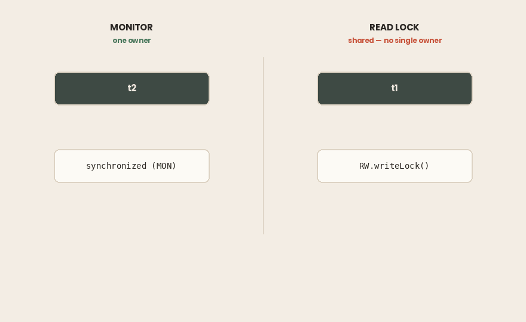

## TL;DR

- `synchronized` and `ReentrantLock` both give you mutual exclusion and a happens-before edge. Neither prevents deadlock.
- `ReentrantLock` adds `tryLock`, timeouts, interruptible waiting, fairness, and multiple `Condition`s. The cost is a mandatory `try/finally` and an `unlock()` you can forget.
- `jstack` detects deadlocks on both, but prints them differently: `waiting to lock monitor` for `synchronized`, `waiting for ownable synchronizer` for `ReentrantLock`.
- Without `-l`, the `Locked ownable synchronizers` section is missing entirely. Always pass `-l`.
- **A monitor plus a** `ReadWriteLock` **read lock can deadlock without the JVM reporting anything.** Both threads hang and the dump stays silent, because a read lock is shared and has no single owner to build a cycle from.
- Four conditions produce a deadlock. Only two are breakable in Java: circular wait (lock ordering) and hold-and-wait (`tryLock` plus backoff).
- Lock ordering finishes the demo below in 20 ms. `tryLock` with backoff needs 320–640 ms for a fifth of the work. Order the locks if you can.
- **Virtual threads never appear in** `jstack` **output**, and a deadlock between them is reported by nothing.
- JDK 21–23 pinned virtual threads inside `synchronized`. JEP 491 fixed that in JDK 24 and removed the `jdk.tracePinnedThreads` flag — which now fails silently. Advice written before that is stale.

> ***Environment for every output below:***
>
> - *Intel Core i7–4700HQ (4 cores / 8 threads, x86–64)*
>
> - *Ubuntu 26.04*
>
> - *Amazon Corretto 21.0.11*
>
> - *Amazon Corretto 25.0.4.*
>
> **Every output below came from six single-file programs.**
>
> *No build tool, no dependencies —* `javac *.java` *and run.*
>
> *The dump sections need two terminals: the program in one,* `jcmd -l` *and* `jstack -l <pid>` *in the other.*
>
> *Source: [*[*github.com/…*](https://github.com/mryakar/article-examples/tree/master/synchronized-vs-reentrantlock)*]*

## A Transfer That Never Completes

Two accounts, two threads, money moving in both directions.

```java
static void transfer(Account from, Account to, double amount) {
    synchronized (from) {
        synchronized (to) {
            from.balance -= amount;
            to.balance += amount;
        }
    }
}
```

`t1` transfers A → B a hundred thousand times. `t2` transfers B → A the same number of times. The method locks both accounts, so no update is lost. The arithmetic is correct.

Run it five times:

```bash

$ for i in 1 2 3 4 5; do timeout 15 java Transfer.java; echo "-- exit $?"; done
-- exit 124
-- exit 124
-- exit 124
-- exit 124
-- exit 124
```

`124` is the exit code of `timeout`. The program never finished, five times out of five. No exception, no error, no output — the process just stops making progress and stays alive until you kill it.

Both threads are correct on their own. Together they stop.

### In short

- Locking both accounts makes each transfer atomic and the balances correct.
- The program still hangs, reliably, with no error of any kind.
- Correct code on each thread does not add up to a correct program.

## What `synchronized` Already Gives You

Every Java object has a **monitor**. `synchronized` acquires it: on `this` for an instance method, on the `Class` object for a static method, on whatever you name in a block.

It is **reentrant**. A thread already holding the monitor can enter again; the JVM keeps a counter and releases at zero. Without this, one `synchronized` method calling another on the same object would deadlock against itself.

And it gives you more than exclusion. From the happens-before rules: *an unlock on a monitor happens-before every later lock on that same monitor*. So `synchronized` also publishes everything the thread did before releasing. Exclusion and visibility, from one keyword.

### In short

- `synchronized` locks an object's monitor: `this`, the `Class` object, or a named object.
- It is reentrant, so nested calls on the same object do not block themselves.
- Unlock happens-before the next lock, so it provides **visibility** as well as exclusion.

## What It Doesn’t

`ReentrantLock` gives the same guarantees and adds five things `synchronized` cannot express.

`tryLock()` returns immediately with `false` instead of waiting. `tryLock(timeout, unit)` waits a bounded time. Together they let a thread give up — which is the whole of the deadlock strategy in a later section.

`lockInterruptibly()` lets a waiting thread respond to `interrupt()`. A thread blocked on `synchronized` cannot be interrupted at all; your shutdown signal is simply ignored.

**Fairness.** `new ReentrantLock(true)` hands the lock to the longest waiter. It removes starvation and costs throughput, because it defeats the barging that makes the unfair path fast. Default to unfair.

**Multiple** `Condition`**s.** `wait`/`notify` gives one queue per object, so `notifyAll` wakes producers and consumers alike. A lock can create separate `Condition` objects and wake only the group that can make progress.

**Non-block-structured locking.** `synchronized` releases at the closing brace. A lock can be acquired in one method and released in another — the basis of hand-over-hand traversal.

### In short

- `tryLock` and `tryLock(timeout)` let a thread stop waiting.
- `lockInterruptibly` makes a waiting thread cancellable; `synchronized` does not.
- Fairness prevents starvation and costs throughput. Multiple `Condition`s wake only the right waiters.
- A lock can be released outside the block it was taken in.

## The Cost of Asking for More

`synchronized` releases the monitor at the closing brace, including when an exception unwinds the stack. There is no way to leak it.

`ReentrantLock` has no closing brace, so you write the release yourself:

```java
lock.lock();
try {
    // critical section
} finally {
    lock.unlock();
}
```

Two mistakes are easy here. Putting `lock()` **inside** the `try` means an exception from `lock()` leads to unlocking a lock you never acquired — `IllegalMonitorStateException`, masking the original error. Forgetting `finally` means one exception on a rare path leaks the lock permanently, and every later thread blocks forever on something that already returned.

This is the argument for `synchronized` as the default. Not that locks are slow — that the safe version of a lock is four lines of ceremony you have to get right every time.

### In short

- `synchronized` always releases, including on exceptions.
- `ReentrantLock` requires `lock()` before `try`, and `unlock()` in `finally`.
- A leaked lock does not fail loudly. Later threads block forever.
- Prefer `synchronized` unless you need something from the previous section.

## Reading the Dump

The hung program is still running, so take a thread dump. Find the process with `jcmd -l`, then:

```bash
jstack <pid>
```

At the end of the output:

```bash
Found one Java-level deadlock:
=============================
"t1":
  waiting to lock monitor 0x00007ccf68000f80 (object 0x00000007242a2088, a Transfer$Account),
  which is held by "t2"
"t2":
  waiting to lock monitor 0x00007ccf5c000f60 (object 0x00000007242a2070, a Transfer$Account),
  which is held by "t1"
```

The JVM found the cycle and named both threads, both objects, and printed the stacks so you can find the lines.


Now the same deadlock built from `ReentrantLock` instead:

```bash
"t1":
  waiting for ownable synchronizer 0x00000007253a3308,
  (a java.util.concurrent.locks.ReentrantLock$NonfairSync),
  which is held by "t2"
```

Same cycle, different words. A monitor is *locked*; a `ReentrantLock` is an **ownable synchronizer**. If you grep thread dumps for `waiting to lock`, you will miss every `java.util.concurrent` deadlock in your system.

One more difference, and it costs nothing to avoid:

```bash
--- without -l: 0
--- with    -l: 14
```

That is the count of `Locked ownable synchronizers` lines. Without `-l`, the dump lists which monitors each thread holds but says nothing about which locks it holds. The deadlock section still appears — but contention that has not yet become a deadlock is invisible. Make `-l` a habit.

### In short

- The JVM detects deadlocks and prints them at the end of the dump. It does not resolve them.
- `synchronized` shows as `waiting to lock monitor`; `ReentrantLock` as `waiting for ownable synchronizer`.
- Searching dumps for only one of those phrases hides half your deadlocks.
- Always use `jstack -l`, or `jcmd <pid> Thread.print -l`.

## The Deadlocks the JVM Will Not Tell You About

The previous section ends on a comfortable note: take a dump, read the section, fix the code. Here is where that stops working.

One thread takes a monitor and then a write lock. Another takes a **read** lock and then the same monitor:

```java
// t1
synchronized (MON) { RW.writeLock().lock(); }
// t2
RW.readLock().lock(); synchronized (MON) { }
```

Both threads hang. The dump shows exactly why:

```bash
"t1" ... java.lang.Thread.State: WAITING (parking)
    - parking to wait for <0x...> (a ReentrantReadWriteLock$NonfairSync)
"t2" ... java.lang.Thread.State: BLOCKED (on object monitor)
    - waiting to lock <0x...> (a java.lang.Object)
```

And then:

```bash
=== deadlock reported? ===
NO DEADLOCK SECTION
=== still stuck? threads alive: 2
```

Ten seconds later both threads are still there. This is a real deadlock, and `jstack -l` says nothing about it.



Deadlock detection works by building a graph of *who owns what* and looking for a cycle. A monitor has exactly one owner. An exclusive `ReentrantLock` has exactly one owner. A **read lock does not** — it is shared by design, held by any number of threads at once, and the JVM cannot name the thread you are waiting behind. The edge is missing, so the cycle is never found.

The practical rule: if a hang involves a `ReadWriteLock`, `Semaphore`, `CountDownLatch`, or any other shared-permit construct, do not trust the absence of a deadlock section. Read the thread states yourself. `WAITING (parking)` plus `BLOCKED (on object monitor)` that persist across two dumps taken a minute apart is a deadlock, whatever the tooling says.

### In short

- A monitor combined with a read lock can deadlock with **no deadlock section in the dump**.
- Detection needs a single owner per resource. Shared locks have none, so the cycle cannot be built.
- The same gap applies to semaphores, latches, and other permit-based constructs.
- Compare two dumps a minute apart. Threads stuck in the same frame are stuck, reported or not.

## Four Conditions, and Which One You Can Break

A deadlock needs all four [**Coffman**](https://en.wikipedia.org/wiki/Deadlock_%28computer_science%29) conditions at once. Remove any one and it cannot form.

**Mutual exclusion** — the resource cannot be shared. This is what a lock is for. Not breakable.

**No preemption** — nothing takes the lock away from its holder. The JVM never does this, and there is no API for it. Not breakable.

**Hold and wait** — a thread holding one lock waits for another. Breakable: acquire everything at once, or release what you hold when you cannot get the rest.

**Circular wait** — the wait-for graph forms a cycle. Breakable: make every thread acquire locks in the same global order, and a cycle becomes impossible.

Two doors out of four, and the rest of this article is those two.

### In short

- Four conditions must hold at once for a deadlock; breaking one is enough.
- Mutual exclusion and no-preemption are not negotiable in Java.
- **Circular wait** is broken by consistent lock ordering.
- **Hold and wait** is broken by `tryLock` with release and retry.

## The Lock You Take Second

The bug in the first program is not that it takes two locks. It is that `t1` takes A then B while `t2` takes B then A. Give both threads the same order and the cycle cannot form:

```java
static void transfer(Account from, Account to, double amount) {
    Account first  = from.id < to.id ? from : to;
    Account second = from.id < to.id ? to   : from;
    synchronized (first) {
        synchronized (second) {
            from.balance -= amount;
            to.balance += amount;
        }
    }
}
```

Nothing else changed. Same locks, same threads, same work:

```bash
completed in 20 ms
A=1000.0  B=1000.0
completed in 21 ms
A=1000.0  B=1000.0
completed in 21 ms
A=1000.0  B=1000.0
```


The ordering key has to be **stable and unique**. A database id or account number is ideal. `System.identityHashCode` works when there is no natural key, with one caveat most articles skip: identity hash codes can collide, and two colliding objects give you no order at all. The fix is a third lock taken first, held only while the tie is being broken. At the end of the day, the best choice is providing uniqueness with a database id or account number. Provide a deterministic ordering.

The real difficulty is not the code — it is that ordering is a **global** property. A rule obeyed in nine methods and broken in the tenth is not a rule. Write the order down, and keep every acquisition in the codebase pointing the same way.

### In short

- Deadlock came from opposite ordering, not from taking two locks.
- Sort by a stable unique key before acquiring. The demo finishes in ~20 ms.
- `identityHashCode` can collide; break the tie with a third lock. Provide a deterministic ordering.
- The rule only works if the entire codebase follows it.

## When You Cannot Order Them

Sometimes there is no key to sort by, or the locks are behind an API you do not control. Then break hold-and-wait instead: take the first lock, try for the second, and **give up both** if it does not come.

```java
if (from.lock.tryLock(50, TimeUnit.MILLISECONDS)) {
    try {
        if (to.lock.tryLock(50, TimeUnit.MILLISECONDS)) {
            try {
                from.balance -= amount;
                to.balance += amount;
                return true;
            } finally { to.lock.unlock(); }
        }
    } finally { from.lock.unlock(); }   // release what we hold
}
retries.incrementAndGet();
Thread.sleep(ThreadLocalRandom.current().nextInt(1, 5));  // backoff with jitter
```

Three details are not optional. **Release the first lock** before retrying — keeping it means hold-and-wait survives and you have built a livelock instead. **Jitter the backoff**, because two threads that collided once will collide again if they retry on the same schedule. **Cap the attempts**, so a permanent conflict fails loudly instead of spinning forever.

It works, and it is not free:

```bash
completed in 638 ms
retries=23
A=1000.0  B=1000.0
completed in 321 ms
retries=12
A=1000.0  B=1000.0
```

Correct balances — and note the loop count. This version does 20,000 transfers per thread, the ordered version did 100,000. A fifth of the work takes 16 to 32 times longer, so per transfer the gap is close to two orders of magnitude. Every failed attempt throws away a lock acquisition, and the numbers move run to run because they depend on how the collisions land.

Use ordering when you can. Use this when you cannot.

### In short

- `tryLock` with a timeout breaks hold-and-wait: fail, release, retry.
- Releasing the lock you already hold is what makes it work.
- Backoff needs jitter, and attempts need a cap.
- Much slower than ordering, and the cost varies per run. Second choice, not first.

## Virtual Threads Are Invisible Here

Everything above assumed a thread dump shows you your threads. Run the same monitor deadlock on two virtual threads:

```java
Thread.ofVirtual().name("vt1").start(() -> {
    synchronized (A) { nap(); synchronized (B) {} }
});
Thread.ofVirtual().name("vt2").start(() -> {
    synchronized (B) { nap(); synchronized (A) {} }
});
```

On Corretto 21 and Corretto 25:

```bash
jstack sees vt threads : 0
jstack reports deadlock: 0
json dump sees vt      : 2
```

`jstack` does not list virtual threads at all — not their stacks, not their names, and not the deadlock between them. The process looks healthy: a handful of carrier threads, nothing blocked, no deadlock section. Netflix published the production version of this in *Java 21 Virtual Threads — Dude, Where's My Lock?*: instances stopped serving traffic while the JVM stayed alive and standard thread dumps showed an idle VM.

The threads are visible through a different tool:

```bash
jcmd <pid> Thread.dump_to_file -format=json /tmp/dump.json
```

That dump contains both virtual threads and their stacks. What it does **not** contain, on either version, is a deadlock section — the analysis in the previous sections has no equivalent here. You get the raw stacks and you do the cycle-finding yourself.

### In short

- `jstack` shows no virtual threads and no deadlock between them, on 21 and 25 alike.
- A stalled virtual-thread application looks like an idle JVM in a standard dump.
- Use `jcmd <pid> Thread.dump_to_file -format=json` to see them.
- Even there, nothing reports the deadlock. Read the stacks yourself.

## JEP 491 Reset the Advice — Check Your JDK

Between JDK 21 and 23 there was a second reason to prefer `ReentrantLock`, and it had nothing to do with the features in this article.

A virtual thread blocking inside `synchronized` **pinned** its carrier platform thread. Blocking in a `ReentrantLock` did not. With enough pinned carriers the scheduler ran out and the application stalled. That is why MySQL Connector/J 9.0.0 and other drivers replaced `synchronized` with `ReentrantLock` — not for interruptibility, but to stop pinning.

Pinning was not an oversight. The JVM tracked monitor ownership by the **carrier** thread’s identity. If a virtual thread could unmount while holding a monitor, the next virtual thread mounted on that carrier would appear to own a lock it never took. Pinning was what kept `synchronized` correct.

**JEP 491, delivered in JDK 24**, made monitors virtual-thread-aware and removed that restriction. Two consequences:

- The `synchronized`-to-`ReentrantLock` migrations are no longer required. Still reasonable for your own code if you want interruptibility or timeouts — no longer a prerequisite for virtual threads.
- The diagnostic flag `-Djdk.tracePinnedThreads` was **removed**, described in the change request as having proven problematic and no longer useful. It does not warn you about this:

```bash
$ java -Djdk.tracePinnedThreads=full -version
openjdk version "21.0.11" 2026-04-21 LTS$ 
$J25/java -Djdk.tracePinnedThreads=full -version
openjdk version "25.0.4" 2026-07-21 LTS
```

No error, no warning, no difference. On 25 the flag is simply gone, and a build script carrying it will look like it is still doing something. The JFR event `jdk.VirtualThreadPinned` remains and was extended to report the reason for pinning and the carrier's identity — use that instead.

Pinning still happens in narrow cases: native frames, the Foreign Function & Memory API calling back into blocking Java code, and class loading.

The JEP states the outcome directly: choose between `synchronized` and `java.util.concurrent.locks` based only on which one solves your problem.

### In short

- JDK 21–23: `synchronized` pinned virtual threads to carriers; `ReentrantLock` did not.
- Pinning existed because monitor ownership was tracked per carrier, not per virtual thread.
- JEP 491 fixed this in **JDK 24**. Migrations done for pinning are no longer necessary.
- `Flag -Djdk.tracePinnedThreads` was removed and fails **silently**. Use the `jdk.VirtualThreadPinned` JFR event.

## Which One, and When

Default to `synchronized`. It cannot leak, it needs no ceremony, and since JDK 24 it carries no virtual-thread penalty.

Reach for `ReentrantLock` when you need something it cannot express: a bounded wait, a `tryLock`, an interruptible acquisition, fairness, or more than one condition queue. Those are real needs, and when you have one the extra four lines are the price.

Neither prevents deadlock. That is what ordering is for.

And often the answer is neither. A counter wants `AtomicInteger`. A shared map wants `ConcurrentHashMap`. State that never changes needs no lock at all. The fastest lock is the one you did not take — which is where the next article goes: compare-and-swap, and the atomic classes built on it.

### In short

- `synchronized` by default; `ReentrantLock` when you need a specific feature from it.
- Since JDK 24 there is no virtual-thread reason to choose between them.
- Neither prevents deadlock — ordering does.
- Prefer atomics, concurrent collections, and immutability over locking at all.

> *The six programs are on GitHub:* [https://github.com/mryakar/article-examples](https://github.com/mryakar/article-examples/tree/master/synchronized-vs-reentrantlock)

## References

**Specification and JEPs**

- *The Java® Language Specification, §17.4.5 — Happens-before Order.*
 [https://docs.oracle.com/javase/specs/jls/se8/html/jls-17.html](https://docs.oracle.com/javase/specs/jls/se8/html/jls-17.html)
- *JEP 491: Synchronize Virtual Threads without Pinning.*
 [https://openjdk.org/jeps/491](https://openjdk.org/jeps/491)
- *JDK-8338813 — CSR for JEP 491.*
 [https://bugs.java.com/bugdatabase/view_bug?bug_id=8338813](https://bugs.java.com/bugdatabase/view_bug?bug_id=8338813)
- *JEP 444: Virtual Threads.*
 [https://openjdk.org/jeps/444](https://openjdk.org/jeps/444)

**API documentation**

- `ReentrantLock`, `ReentrantReadWriteLock`, `Condition` — `java.util.concurrent.locks`.
 [https://docs.oracle.com/en/java/javase/21/docs/api/java.base/java/util/concurrent/locks/package-summary.html](https://docs.oracle.com/en/java/javase/21/docs/api/java.base/java/util/concurrent/locks/package-summary.html)
- *The jstack Utility* — the `-l` option and the deadlock detection section.
 [https://docs.oracle.com/javase/8/docs/technotes/guides/troubleshoot/tooldescr016.html](https://docs.oracle.com/javase/8/docs/technotes/guides/troubleshoot/tooldescr016.html)

**Field reports**

- Netflix Technology Blog, *Java 21 Virtual Threads — Dude, Where’s My Lock?*
- MySQL Connector/J 9.0.0 release notes — `synchronized` replaced with `ReentrantLock` for virtual-thread friendliness.

**Further reading**

- Brian Goetz et al., *Java Concurrency in Practice*
- Doug Lea, *The JSR-133 Cookbook for Compiler Writers*
 [https://gee.cs.oswego.edu/dl/jmm/cookbook.html](https://gee.cs.oswego.edu/dl/jmm/cookbook.html)
