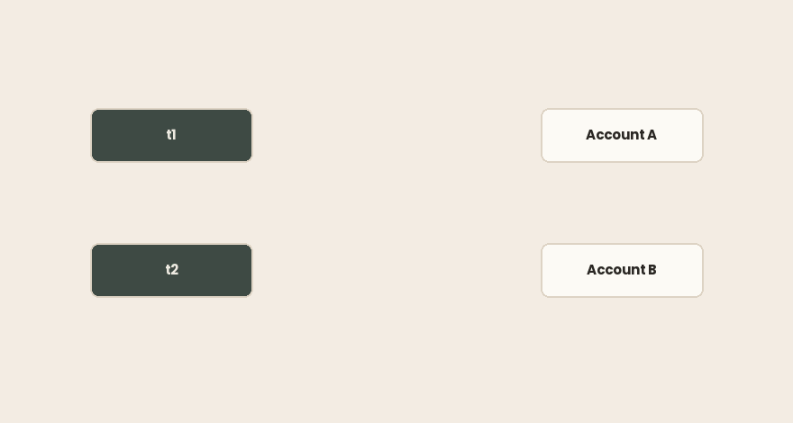
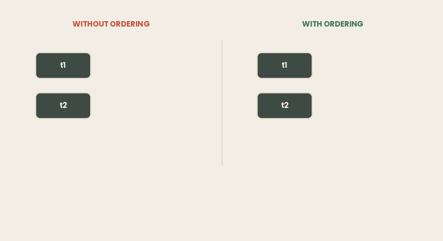

## TL;DR

- `synchronized` ve `ReentrantLock` ikisi de size karşılıklı dışlama (mutual exclusion) ve bir happens-before kenarı verir. İkisi de deadlock'u önlemez.
- `ReentrantLock`; `tryLock`, zaman aşımları, kesilebilir bekleme, adillik (fairness) ve birden fazla `Condition` ekler. Bedeli zorunlu bir `try/finally` ve unutabileceğiniz bir `unlock()`'tur.
- `jstack` ikisinde de deadlock'ları tespit eder, ama onları farklı yazdırır: `synchronized` için `waiting to lock monitor`, `ReentrantLock` için `waiting for ownable synchronizer`.
- `-l` olmadan `Locked ownable synchronizers` bölümü tamamen eksiktir. Her zaman `-l` verin.
- **Bir monitor ile bir** `ReadWriteLock` **okuma kilidi, JVM hiçbir şey bildirmeden deadlock'a girebilir.** İki thread de takılır ve dump sessiz kalır, çünkü okuma kilidi paylaşılır ve bir döngü kurulabilecek tek bir sahibi yoktur.
- Dört koşul deadlock üretir. Java'da yalnızca ikisi kırılabilir: döngüsel bekleme (kilit sıralaması) ve tut-ve-bekle (`tryLock` artı geri çekilme).
- Kilit sıralaması aşağıdaki demoyu 20 ms'de bitirir. Geri çekilmeli `tryLock`, işin beşte biri için 320–640 ms ister. Yapabiliyorsanız kilitleri sıralayın.
- **Sanal thread'ler** `jstack` **çıktısında hiç görünmez** ve aralarındaki bir deadlock'u hiçbir şey bildirmez.
- JDK 21–23, sanal thread'leri `synchronized` içinde sabitliyordu (pinning). JEP 491 bunu JDK 24'te düzeltti ve `jdk.tracePinnedThreads` bayrağını kaldırdı; bayrak artık sessizce başarısız oluyor. Bundan önce yazılmış tavsiyeler eskidi.

> ***Aşağıdaki her çıktının ortamı:***
>
> - *Intel Core i7–4700HQ (4 çekirdek / 8 thread, x86–64)*
>
> - *Ubuntu 26.04*
>
> - *Amazon Corretto 21.0.11*
>
> - *Amazon Corretto 25.0.4.*
>
> **Aşağıdaki her çıktı altı tek dosyalık programdan geldi.**
>
> *Derleme aracı yok, bağımlılık yok —* `javac *.java` *ve çalıştırın.*
>
> *Dump bölümleri iki terminal ister: birinde program, diğerinde* `jcmd -l` *ve* `jstack -l <pid>`*.*
>
> *Kaynak: [*[*github.com/…*](https://github.com/mryakar/article-examples/tree/master/synchronized-vs-reentrantlock)*]*

## Hiç Tamamlanmayan Bir Transfer

İki hesap, iki thread, iki yönde hareket eden para.

```java
static void transfer(Account from, Account to, double amount) {
    synchronized (from) {
        synchronized (to) {
            from.balance -= amount;
            to.balance += amount;
        }
    }
}
```

`t1` A → B transferini yüz bin kez yapar. `t2` B → A transferini aynı sayıda yapar. Metot iki hesabı da kilitler, dolayısıyla hiçbir güncelleme kaybolmaz. Aritmetik doğrudur.

Beş kez çalıştırın:

```bash

$ for i in 1 2 3 4 5; do timeout 15 java Transfer.java; echo "-- exit $?"; done
-- exit 124
-- exit 124
-- exit 124
-- exit 124
-- exit 124
```

`124`, `timeout`'un çıkış kodudur. Program beşte beş kez hiç bitmedi. İstisna yok, hata yok, çıktı yok; süreç yalnızca ilerlemeyi durdurur ve siz öldürene kadar canlı kalır.

İki thread de tek başına doğrudur. Birlikte dururlar.

### Kısaca

- İki hesabı da kilitlemek her transferi atomik ve bakiyeleri doğru yapar.
- Program yine de, güvenilir biçimde, hiçbir türden hata vermeden takılır.
- Her thread'deki doğru kod, toplamda doğru bir program etmez.

## `synchronized`'ın Size Zaten Verdikleri

Her Java nesnesinin bir **monitor**'ü vardır. `synchronized` onu edinir: örnek metodu için `this` üzerinde, static metot için `Class` nesnesi üzerinde, blokta ise adını verdiğiniz nesne üzerinde.

**Yeniden girilebilirdir** (reentrant). Monitor'ü zaten tutan bir thread yeniden girebilir; JVM bir sayaç tutar ve sıfırda serbest bırakır. Bu olmasaydı, aynı nesne üzerinde başka bir `synchronized` metodu çağıran bir `synchronized` metot kendisiyle deadlock'a girerdi.

Ve size dışlamadan fazlasını verir. Happens-before kurallarından: *bir monitor üzerindeki bir unlock, aynı monitor üzerindeki sonraki her lock'tan önce gerçekleşir (happens-before)*. Dolayısıyla `synchronized`, thread'in serbest bırakmadan önce yaptığı her şeyi de yayımlar. Tek bir anahtar sözcükten hem dışlama hem görünürlük.

### Kısaca

- `synchronized` bir nesnenin monitor'ünü kilitler: `this`, `Class` nesnesi ya da adı verilen bir nesne.
- Yeniden girilebilir olduğu için aynı nesne üzerindeki iç içe çağrılar kendilerini bloklamaz.
- Unlock bir sonraki lock'tan önce gerçekleşir (happens-before); böylece dışlamanın yanı sıra **görünürlük** de sağlar.

## Vermedikleri

`ReentrantLock` aynı garantileri verir ve `synchronized`'ın ifade edemediği beş şey ekler.

`tryLock()` beklemek yerine hemen `false` ile döner. `tryLock(timeout, unit)` sınırlı bir süre bekler. Birlikte bir thread'in vazgeçmesini sağlarlar; bu da ileriki bir bölümdeki deadlock stratejisinin tamamıdır.

`lockInterruptibly()` bekleyen bir thread'in `interrupt()`'a yanıt vermesini sağlar. `synchronized` üzerinde bloklanmış bir thread hiç kesilemez; kapatma sinyaliniz düpedüz yok sayılır.

**Adillik.** `new ReentrantLock(true)` kilidi en uzun bekleyene verir. Açlığı (starvation) ortadan kaldırır ve iş hacminden (throughput) götürür, çünkü adil olmayan yolu hızlı yapan sıra atlamayı (barging) engeller. Varsayılan olarak adil olmayanı kullanın.

**Birden fazla** `Condition`**.** `wait`/`notify` nesne başına tek bir kuyruk verir, dolayısıyla `notifyAll` üreticileri de tüketicileri de uyandırır. Bir kilit ayrı `Condition` nesneleri oluşturabilir ve yalnızca ilerleyebilecek grubu uyandırabilir.

**Blok yapısına bağlı olmayan kilitleme.** `synchronized` kapanan süslü parantezde serbest bırakır. Bir kilit bir metotta edinilip başka bir metotta serbest bırakılabilir; el değiştirmeli (hand-over-hand) gezinmenin temeli budur.

### Kısaca

- `tryLock` ve `tryLock(timeout)` bir thread'in beklemeyi bırakmasını sağlar.
- `lockInterruptibly` bekleyen bir thread'i iptal edilebilir yapar; `synchronized` yapmaz.
- Adillik açlığı önler ve iş hacminden götürür. Birden fazla `Condition` yalnızca doğru bekleyenleri uyandırır.
- Bir kilit, alındığı bloğun dışında serbest bırakılabilir.

## Daha Fazlasını İstemenin Bedeli

`synchronized`, bir istisna yığını geri sardığında da dahil olmak üzere, monitor'ü kapanan süslü parantezde serbest bırakır. Onu sızdırmanın bir yolu yoktur.

`ReentrantLock`'un kapanan süslü parantezi yoktur, dolayısıyla serbest bırakmayı kendiniz yazarsınız:

```java
lock.lock();
try {
    // critical section
} finally {
    lock.unlock();
}
```

Burada iki hata kolaydır. `lock()`'u `try`'ın **içine** koymak, `lock()`'tan gelen bir istisnanın hiç edinmediğiniz bir kilidin açılmasına yol açması demektir; bu da özgün hatayı gizleyen bir `IllegalMonitorStateException` olur. `finally`'yi unutmak, nadir bir yoldaki tek bir istisnanın kilidi kalıcı olarak sızdırması demektir; sonraki her thread, zaten dönmüş bir şey üzerinde sonsuza dek bloklanır.

`synchronized`'ın varsayılan olması gerektiğine dair argüman budur. Kilitlerin yavaş olması değil; bir kilidin güvenli sürümünün, her seferinde doğru yapmanız gereken dört satırlık bir tören olması.

### Kısaca

- `synchronized` istisnalar da dahil olmak üzere her zaman serbest bırakır.
- `ReentrantLock`, `lock()`'un `try`'dan önce ve `unlock()`'un `finally` içinde olmasını gerektirir.
- Sızan bir kilit gürültüyle başarısız olmaz. Sonraki thread'ler sonsuza dek bloklanır.
- Önceki bölümden bir şeye ihtiyacınız yoksa `synchronized`'ı tercih edin.

## Dump'ı Okumak

Takılan program hâlâ çalışıyor, dolayısıyla bir thread dump alın. Süreci `jcmd -l` ile bulun, ardından:

```bash
jstack <pid>
```

Çıktının sonunda:

```bash
Found one Java-level deadlock:
=============================
"t1":
  waiting to lock monitor 0x00007ccf68000f80 (object 0x00000007242a2088, a Transfer$Account),
  which is held by "t2"
"t2":
  waiting to lock monitor 0x00007ccf5c000f60 (object 0x00000007242a2070, a Transfer$Account),
  which is held by "t1"
```

JVM döngüyü buldu, iki thread'i ve iki nesneyi adlandırdı ve satırları bulabilmeniz için yığınları yazdırdı.



Şimdi aynı deadlock, bu sefer `ReentrantLock`'tan kurulmuş hali:

```bash
"t1":
  waiting for ownable synchronizer 0x00000007253a3308,
  (a java.util.concurrent.locks.ReentrantLock$NonfairSync),
  which is held by "t2"
```

Aynı döngü, farklı sözcükler. Bir monitor *kilitlenir*; bir `ReentrantLock` ise bir **ownable synchronizer**'dır (sahiplenilebilir eşzamanlayıcı). Thread dump'larında `waiting to lock` diye grep yaparsanız, sisteminizdeki her `java.util.concurrent` deadlock'unu kaçırırsınız.

Bir fark daha var ve ondan kaçınmanın bir maliyeti yok:

```bash
--- without -l: 0
--- with    -l: 14
```

Bu, `Locked ownable synchronizers` satırlarının sayısıdır. `-l` olmadan dump, her thread'in hangi monitor'leri tuttuğunu listeler ama hangi kilitleri tuttuğu hakkında hiçbir şey söylemez. Deadlock bölümü yine görünür; ama henüz deadlock'a dönüşmemiş çekişme görünmez olur. `-l`'yi alışkanlık haline getirin.

### Kısaca

- JVM deadlock'ları tespit eder ve dump'ın sonunda yazdırır. Onları çözmez.
- `synchronized`, `waiting to lock monitor` olarak; `ReentrantLock`, `waiting for ownable synchronizer` olarak görünür.
- Dump'larda bu ifadelerden yalnızca birini aramak deadlock'larınızın yarısını gizler.
- Her zaman `jstack -l` ya da `jcmd <pid> Thread.print -l` kullanın.

## JVM'nin Size Söylemeyeceği Deadlock'lar

Önceki bölüm rahatlatıcı bir notla bitiyor: bir dump alın, bölümü okuyun, kodu düzeltin. İşte bunun işe yaramadığı yer.

Bir thread önce bir monitor'ü, sonra bir yazma kilidini alır. Bir diğeri önce bir **okuma** kilidini, sonra aynı monitor'ü alır:

```java
// t1
synchronized (MON) { RW.writeLock().lock(); }
// t2
RW.readLock().lock(); synchronized (MON) { }
```

İki thread de takılır. Dump nedenini tam olarak gösterir:

```bash
"t1" ... java.lang.Thread.State: WAITING (parking)
    - parking to wait for <0x...> (a ReentrantReadWriteLock$NonfairSync)
"t2" ... java.lang.Thread.State: BLOCKED (on object monitor)
    - waiting to lock <0x...> (a java.lang.Object)
```

Ve sonra:

```bash
=== deadlock reported? ===
NO DEADLOCK SECTION
=== still stuck? threads alive: 2
```

On saniye sonra iki thread de hâlâ orada. Bu gerçek bir deadlock ve `jstack -l` onun hakkında hiçbir şey söylemiyor.


Deadlock tespiti, *kimin neye sahip olduğunun* bir grafiğini kurup bir döngü arayarak çalışır. Bir monitor'ün tam olarak bir sahibi vardır. Dışlayıcı (exclusive) bir `ReentrantLock`'un tam olarak bir sahibi vardır. **Okuma kilidinin yoktur**; tasarımı gereği paylaşılır, aynı anda istenen sayıda thread tarafından tutulur ve JVM arkasında beklediğiniz thread'i adlandıramaz. Kenar eksiktir, dolayısıyla döngü hiç bulunmaz.

Pratik kural: bir takılmada `ReadWriteLock`, `Semaphore`, `CountDownLatch` ya da paylaşılan izin mantığıyla çalışan herhangi bir yapı varsa, deadlock bölümünün yokluğuna güvenmeyin. Thread durumlarını kendiniz okuyun. Bir dakika arayla alınmış iki dump boyunca süren `WAITING (parking)` artı `BLOCKED (on object monitor)`, araçlar ne derse desin bir deadlock'tur.

### Kısaca

- Bir okuma kilidiyle birleşen bir monitor, **dump'ta hiçbir deadlock bölümü olmadan** deadlock'a girebilir.
- Tespit, kaynak başına tek bir sahip gerektirir. Paylaşılan kilitlerin sahibi yoktur, dolayısıyla döngü kurulamaz.
- Aynı boşluk semaforlar, latch'ler ve izin tabanlı diğer yapılar için de geçerlidir.
- Bir dakika arayla alınmış iki dump'ı karşılaştırın. Aynı çerçevede takılı kalan thread'ler, bildirilsin ya da bildirilmesin, takılmıştır.

## Dört Koşul ve Hangisini Kırabileceğiniz

Bir deadlock, dört [**Coffman**](https://en.wikipedia.org/wiki/Deadlock_%28computer_science%29) koşulunun hepsinin aynı anda sağlanmasını gerektirir. Herhangi birini kaldırın, deadlock oluşamaz.

**Karşılıklı dışlama** — kaynak paylaşılamaz. Kilit zaten bunun içindir. Kırılamaz.

**El koyma yok (no preemption)** — hiçbir şey kilidi sahibinden almaz. JVM bunu asla yapmaz ve bunun için bir API yoktur. Kırılamaz.

**Tut ve bekle (hold and wait)** — bir kilidi tutan thread başka birini bekler. Kırılabilir: her şeyi bir kerede edinin ya da gerisini alamadığınızda tuttuğunuzu bırakın.

**Döngüsel bekleme (circular wait)** — bekleme grafiği bir döngü oluşturur. Kırılabilir: her thread'in kilitleri aynı küresel sırayla edinmesini sağlayın, döngü imkânsız hale gelir.

Dört kapıdan ikisi dışarı açılıyor ve bu yazının geri kalanı o ikisi.

### Kısaca

- Deadlock için dört koşulun aynı anda sağlanması gerekir; birini kırmak yeterlidir.
- Karşılıklı dışlama ve el koyma yokluğu (no preemption) Java'da pazarlık konusu değildir.
- **Döngüsel bekleme**, tutarlı kilit sıralamasıyla kırılır.
- **Tut ve bekle**, bırakıp yeniden deneyen `tryLock` ile kırılır.

## İkinci Aldığınız Kilit

İlk programdaki hata iki kilit alması değil. Hata, `t2` önce B'yi sonra A'yı alırken `t1`'in önce A'yı sonra B'yi almasıdır. İki thread'e de aynı sırayı verin, döngü oluşamaz:

```java
static void transfer(Account from, Account to, double amount) {
    Account first  = from.id < to.id ? from : to;
    Account second = from.id < to.id ? to   : from;
    synchronized (first) {
        synchronized (second) {
            from.balance -= amount;
            to.balance += amount;
        }
    }
}
```

Başka hiçbir şey değişmedi. Aynı kilitler, aynı thread'ler, aynı iş:

```bash
completed in 20 ms
A=1000.0  B=1000.0
completed in 21 ms
A=1000.0  B=1000.0
completed in 21 ms
A=1000.0  B=1000.0
```



Sıralama anahtarı **kararlı ve benzersiz** olmalıdır. Bir veritabanı kimliği ya da hesap numarası idealdir. Doğal bir anahtar yoksa `System.identityHashCode` işe yarar; ama yazıların çoğunun atladığı bir çekinceyle: kimlik hash kodları çakışabilir ve çakışan iki nesne size hiçbir sıra vermez. Çözüm, önce alınan ve yalnızca eşitlik bozulurken tutulan üçüncü bir kilittir. Sonuç olarak en iyi seçim, benzersizliği bir veritabanı kimliği ya da hesap numarasıyla sağlamaktır. Belirlenimci (deterministic) bir sıralama sağlayın.

Asıl zorluk kod değil; sıralamanın **küresel** bir özellik olmasıdır. Dokuz metotta uyulup onuncusunda çiğnenen bir kural, kural değildir. Sırayı yazıya dökün ve kod tabanındaki her edinmenin aynı yönü göstermesini sağlayın.

### Kısaca

- Deadlock iki kilit almaktan değil, ters sıralamadan kaynaklandı.
- Edinmeden önce kararlı, benzersiz bir anahtara göre sıralayın. Demo ~20 ms'de biter.
- `identityHashCode` çakışabilir; eşitliği üçüncü bir kilitle bozun. Belirlenimci bir sıralama sağlayın.
- Kural ancak bütün kod tabanı ona uyarsa işe yarar.

## Sıralayamadığınızda

Bazen sıralanacak bir anahtar yoktur ya da kilitler kontrol etmediğiniz bir API'nin arkasındadır. O zaman bunun yerine tut-ve-bekle'yi kırın: ilk kilidi alın, ikincisini deneyin ve gelmezse **ikisinden de vazgeçin**.

```java
if (from.lock.tryLock(50, TimeUnit.MILLISECONDS)) {
    try {
        if (to.lock.tryLock(50, TimeUnit.MILLISECONDS)) {
            try {
                from.balance -= amount;
                to.balance += amount;
                return true;
            } finally { to.lock.unlock(); }
        }
    } finally { from.lock.unlock(); }   // release what we hold
}
retries.incrementAndGet();
Thread.sleep(ThreadLocalRandom.current().nextInt(1, 5));  // backoff with jitter
```

Üç ayrıntı isteğe bağlı değildir. Yeniden denemeden önce **ilk kilidi bırakın**; onu tutmak, tut-ve-bekle'nin sürmesi ve onun yerine bir livelock kurmuş olmanız demektir. **Geri çekilmeye rastgelelik (jitter) ekleyin**, çünkü bir kez çakışmış iki thread aynı takvimle yeniden denerse yine çakışır. **Deneme sayısına sınır koyun**, böylece kalıcı bir çakışma sonsuza dek dönmek yerine gürültüyle başarısız olur.

İşe yarıyor ve bedava değil:

```bash
completed in 638 ms
retries=23
A=1000.0  B=1000.0
completed in 321 ms
retries=12
A=1000.0  B=1000.0
```

Bakiyeler doğru; ve döngü sayısına dikkat edin. Bu sürüm thread başına 20.000 transfer yapıyor, sıralı sürüm 100.000 yapmıştı. İşin beşte biri 16 ila 32 kat daha uzun sürüyor, dolayısıyla transfer başına fark iki büyüklük mertebesine yakın. Her başarısız deneme bir kilit edinimini çöpe atıyor ve sayılar çalıştırmadan çalıştırmaya değişiyor, çünkü çakışmaların nasıl denk geldiğine bağlılar.

Yapabildiğinizde sıralamayı kullanın. Yapamadığınızda bunu kullanın.

### Kısaca

- Zaman aşımlı `tryLock` tut-ve-bekle'yi kırar: başarısız ol, bırak, yeniden dene.
- İşe yaramasını sağlayan, zaten tuttuğunuz kilidi bırakmaktır.
- Geri çekilmenin rastgeleliğe, denemelerin de sınıra ihtiyacı vardır.
- Sıralamadan çok daha yavaştır ve maliyeti çalıştırmaya göre değişir. İlk değil, ikinci seçenektir.

## Sanal Thread'ler Burada Görünmez

Yukarıdaki her şey, bir thread dump'ın size thread'lerinizi gösterdiğini varsaydı. Aynı monitor deadlock'unu iki sanal thread üzerinde çalıştırın:

```java
Thread.ofVirtual().name("vt1").start(() -> {
    synchronized (A) { nap(); synchronized (B) {} }
});
Thread.ofVirtual().name("vt2").start(() -> {
    synchronized (B) { nap(); synchronized (A) {} }
});
```

Corretto 21 ve Corretto 25'te:

```bash
jstack sees vt threads : 0
jstack reports deadlock: 0
json dump sees vt      : 2
```

`jstack` sanal thread'leri hiç listelemez; ne yığınlarını, ne adlarını, ne de aralarındaki deadlock'u. Süreç sağlıklı görünür: bir avuç taşıyıcı (carrier) thread, bloklanmış hiçbir şey yok, deadlock bölümü yok. Netflix bunun üretimdeki sürümünü *Java 21 Virtual Threads — Dude, Where's My Lock?* başlığıyla yayımladı: JVM canlı kalırken örnekler trafik sunmayı bıraktı ve standart thread dump'ları boşta bir VM gösterdi.

Thread'ler farklı bir araçla görünür:

```bash
jcmd <pid> Thread.dump_to_file -format=json /tmp/dump.json
```

Bu dump iki sanal thread'i ve yığınlarını içerir. İki sürümde de **içermediği** şey bir deadlock bölümüdür; önceki bölümlerdeki analizin burada karşılığı yoktur. Ham yığınları alırsınız ve döngüyü kendiniz bulursunuz.

### Kısaca

- `jstack`, 21'de de 25'te de hiçbir sanal thread'i ve aralarındaki hiçbir deadlock'u göstermez.
- Takılmış bir sanal thread uygulaması, standart bir dump'ta boşta bir JVM gibi görünür.
- Onları görmek için `jcmd <pid> Thread.dump_to_file -format=json` kullanın.
- Orada bile deadlock'u hiçbir şey bildirmez. Yığınları kendiniz okuyun.

## JEP 491 Tavsiyeyi Sıfırladı — JDK'nızı Kontrol Edin

JDK 21 ile 23 arasında `ReentrantLock`'u tercih etmek için ikinci bir neden vardı ve bunun bu yazıdaki özelliklerle hiçbir ilgisi yoktu.

`synchronized` içinde bloklanan bir sanal thread, taşıyıcı platform thread'ini **sabitliyordu** (pinning). `ReentrantLock` içinde bloklanmak sabitlemiyordu. Yeterince taşıyıcı sabitlendiğinde zamanlayıcının taşıyıcısı tükeniyor ve uygulama takılıyordu. MySQL Connector/J 9.0.0 ve diğer sürücülerin `synchronized`'ı `ReentrantLock` ile değiştirmesinin nedeni budur; kesilebilirlik için değil, sabitlemeyi durdurmak için.

Sabitleme bir gözden kaçırma değildi. JVM, monitor sahipliğini **taşıyıcı** thread'in kimliğine göre izliyordu. Bir sanal thread bir monitor'ü tutarken taşıyıcıdan inebilseydi, o taşıyıcıya binen sonraki sanal thread hiç almadığı bir kilidin sahibi gibi görünürdü. `synchronized`'ı doğru tutan şey sabitlemeydi.

**JDK 24'te teslim edilen JEP 491**, monitor'leri sanal thread'lerin farkında hale getirdi ve bu kısıtlamayı kaldırdı. İki sonucu var:

- `synchronized`'dan `ReentrantLock`'a geçişler artık gerekli değil. Kesilebilirlik ya da zaman aşımı istiyorsanız kendi kodunuz için hâlâ makul; ama artık sanal thread'lerin ön koşulu değil.
- `-Djdk.tracePinnedThreads` tanılama bayrağı **kaldırıldı**; değişiklik talebinde sorunlu olduğu kanıtlanmış ve artık yararlı olmayan bir bayrak olarak tanımlandı. Sizi bu konuda uyarmıyor:

```bash
$ java -Djdk.tracePinnedThreads=full -version
openjdk version "21.0.11" 2026-04-21 LTS$ 
$J25/java -Djdk.tracePinnedThreads=full -version
openjdk version "25.0.4" 2026-07-21 LTS
```

Hata yok, uyarı yok, fark yok. 25'te bayrak düpedüz yok ve onu taşıyan bir derleme betiği hâlâ bir şey yapıyormuş gibi görünecek. JFR olayı `jdk.VirtualThreadPinned` duruyor ve sabitlemenin nedenini ve taşıyıcının kimliğini bildirecek şekilde genişletildi; onun yerine bunu kullanın.

Sabitleme dar durumlarda hâlâ oluyor: native çerçeveler, bloklayan Java koduna geri çağrı yapan Foreign Function & Memory API ve sınıf yükleme.

JEP sonucu doğrudan belirtiyor: `synchronized` ile `java.util.concurrent.locks` arasında yalnızca hangisinin sorununuzu çözdüğüne göre seçim yapın.

### Kısaca

- JDK 21–23: `synchronized` sanal thread'leri taşıyıcılara sabitliyordu; `ReentrantLock` sabitlemiyordu.
- Sabitleme, monitor sahipliği sanal thread başına değil taşıyıcı başına izlendiği için vardı.
- JEP 491 bunu **JDK 24**'te düzeltti. Sabitleme yüzünden yapılan geçişler artık gerekli değil.
- `-Djdk.tracePinnedThreads` bayrağı kaldırıldı ve **sessizce** başarısız oluyor. `jdk.VirtualThreadPinned` JFR olayını kullanın.

## Hangisi ve Ne Zaman

Varsayılan olarak `synchronized` kullanın. Sızamaz, tören gerektirmez ve JDK 24'ten beri sanal thread cezası taşımaz.

İfade edemediği bir şeye ihtiyacınız olduğunda `ReentrantLock`'a uzanın: sınırlı bir bekleme, bir `tryLock`, kesilebilir bir edinme, adillik ya da birden fazla koşul kuyruğu. Bunlar gerçek ihtiyaçlardır ve birine sahip olduğunuzda fazladan dört satır bunun bedelidir.

İkisi de deadlock'u önlemez. Sıralama bunun içindir.

Ve çoğu zaman cevap ikisi de değildir. Bir sayaç `AtomicInteger` ister. Paylaşılan bir map `ConcurrentHashMap` ister. Hiç değişmeyen durum hiç kilit gerektirmez. En hızlı kilit, almadığınız kilittir; bir sonraki yazı da oraya gidiyor: compare-and-swap ve onun üzerine kurulu atomik sınıflar.

### Kısaca

- Varsayılan olarak `synchronized`; ondan belirli bir özelliğe ihtiyacınız olduğunda `ReentrantLock`.
- JDK 24'ten beri aralarında seçim yapmak için sanal thread'le ilgili bir neden yok.
- İkisi de deadlock'u önlemez; sıralama önler.
- Kilitlemeye hiç başvurmak yerine atomikleri, eşzamanlı koleksiyonları ve değişmezliği tercih edin.

> *Altı program GitHub'da:* [https://github.com/mryakar/article-examples](https://github.com/mryakar/article-examples/tree/master/synchronized-vs-reentrantlock)

## Kaynaklar

**Spesifikasyon ve JEP'ler**

- *The Java® Language Specification, §17.4.5 — Happens-before Order.*
 [https://docs.oracle.com/javase/specs/jls/se8/html/jls-17.html](https://docs.oracle.com/javase/specs/jls/se8/html/jls-17.html)
- *JEP 491: Synchronize Virtual Threads without Pinning.*
 [https://openjdk.org/jeps/491](https://openjdk.org/jeps/491)
- *JDK-8338813 — CSR for JEP 491.*
 [https://bugs.java.com/bugdatabase/view_bug?bug_id=8338813](https://bugs.java.com/bugdatabase/view_bug?bug_id=8338813)
- *JEP 444: Virtual Threads.*
 [https://openjdk.org/jeps/444](https://openjdk.org/jeps/444)

**API belgeleri**

- `ReentrantLock`, `ReentrantReadWriteLock`, `Condition` — `java.util.concurrent.locks`.
 [https://docs.oracle.com/en/java/javase/21/docs/api/java.base/java/util/concurrent/locks/package-summary.html](https://docs.oracle.com/en/java/javase/21/docs/api/java.base/java/util/concurrent/locks/package-summary.html)
- *The jstack Utility* — `-l` seçeneği ve deadlock tespit bölümü.
 [https://docs.oracle.com/javase/8/docs/technotes/guides/troubleshoot/tooldescr016.html](https://docs.oracle.com/javase/8/docs/technotes/guides/troubleshoot/tooldescr016.html)

**Sahadan raporlar**

- Netflix Technology Blog, *Java 21 Virtual Threads — Dude, Where’s My Lock?*
- MySQL Connector/J 9.0.0 sürüm notları — sanal thread dostu olmak için `synchronized` yerine `ReentrantLock`.

**İleri okuma**

- Brian Goetz ve diğerleri, *Java Concurrency in Practice*
- Doug Lea, *The JSR-133 Cookbook for Compiler Writers*
 [https://gee.cs.oswego.edu/dl/jmm/cookbook.html](https://gee.cs.oswego.edu/dl/jmm/cookbook.html)
