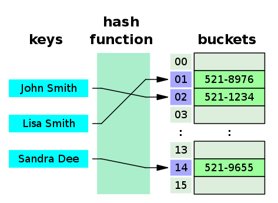

The **hashCode()** and **equals()** methods in Java Programming have a mutual contract and they also can’t function independently of one another; they are **interdependent**. This symbiotic relationship defines the core necessity for their concurrent and harmonious implementation within class definitions, as they serve complementary roles in object comparisons and hash-based data structures.

Indeed, the **hashCode()**and **equals()** methods are regarded as inseparable companions within a class definition. Their joint presence in a class is pivotal for averting numerous bugs or errors that could be challenging to detect and rectify. The collaborative existence of both methods ensures a comprehensive and accurate handling of object comparisons and hash-based data structures, contributing significantly to the reliability and integrity of the codebase.

In this article, we’ll dive into the specifics of the **hashCode()** method within the Java programming language. To commence, we’ll lay the foundation by exploring fundamental definitions integral to understanding this topic. It’s essential to reinforce these definitions with more intricate and critical concepts.

Subsequently, we’ll dive into the application of the hashing mechanism in Java and dissect the details surrounding the **hashCode()** method, unveiling how it operates within the Java runtime environment. Finally, we’ll explore the inseparable connection between the **equals()** and **hashCode()** methods. This exploration will involve understanding specific data structures and elucidate how these methods coordinate and complement each other within these structures.

It seems there’s a strong interconnection between the concepts discussed in this article and the “**equals()** method” in Java programming. Understanding the “equals() method” is crucial for comprehending the content covered in [**this**](https://medium.com/@mr-yakar/how-to-write-equals-in-java-5e9a908045a1) article. If you’re not well-versed in the “equals() method,” I’d recommend pausing here and familiarizing yourself with that content first. It will significantly enhance your understanding of the topics discussed herein due to their close correlation.

Let’s start with the introduction by giving some definitions.

---

## What is Hashing?

In simple terms, hashing is the process of transforming a set of data into an alternative form. Essentially, it involves converting a value into another value. The resulting converted value is irreversible and commonly referred to as a “hash.”

## What is Hash Function?

According to [Wikipedia](https://en.wikipedia.org/wiki/Hash_function);

> A hash function is any function that can be used to map data of arbitrary size to fixed-size values.

In essence, a hash function is designed to produce a converted value of a fixed size utilizing one of the mathematical hashing algorithms. Moreover, there exist specific algorithms that can generate converted values of variable sizes.

Consider the following function ‘h’ as an example of a hash function:

> h(k) = k (mod 10)

Since *k* represents for key, the following hashes are generated;

> h(1) = 1

> h(12) = 2

> h(896543) = 3

Certainly, various mathematical algorithms are employed for data conversions. However, if a method allows the converted data to be restored back to its original form straightforwardly, it does not align with the principles of hashing; rather, it falls under the category of encoding/decoding, which may be a separate topic of discussion.

Similarly, if a unique key is used for data conversion and another key, whether the same or different, is required to revert the data to its original state, this process is recognized as encryption/decryption. These concepts diverge from the fundamental properties of hashing and might be explored in a separate article.

A hash function operates using a **one-way** algorithm, meaning data is transformed **irreversibly** into another form. This irreversible transformation prohibits the retrieval of the original data. In the earlier mentioned function ‘h,’ the modulo operation in mathematics, for instance, is an irreversible process. For instance, both 12 mod 10 and 22 mod 10 result in 2, which indicates that distinct values such as 12 and 22 cannot be uniquely obtained from the output.

However, the generation of identical results for different keys poses a significant issue in hashing, referred to as hash collision. The details regarding collision will be elaborated in one of the upcoming sections.

The quality and suitability of a hashing algorithm hinge on several critical properties, including the ability to produce unique results, irreversibility, and swift calculation of the hash. These properties are pivotal in determining the effectiveness and reliability of a mathematical conversion algorithm employed for hashing purposes.

Indeed, hashing provides numerous benefits and is extensively employed across various domains such as mathematics, data security, electronic communication, and more. Each of these fields leverages hashing techniques according to their specific requirements.

In computer science, hashing is prominently utilized in tandem with data structures, particularly in hash tables. Exploring the intricacies of the hash table data structure will shed light on how hashing is applied and its significance within the realm of computer science.

## What is Hash Table?

According to [Wikipedia;](https://en.wikipedia.org/wiki/Hash_table)

> In computing, a hash table, also known as hash map, is a data structure that implements an associative array or dictionary. It is an abstract data type that maps keys to values. A hash table uses a hash function to compute an index, also called a hash code, into an array of buckets or slots, from which the desired value can be found. During lookup, the key is hashed and the resulting hash indicates where the corresponding value is stored.

In short, a hash table comprises keys in their hashed forms and corresponding values. Let’s examine the following example of a hash table as described on Wikipedia:



*A small phone book as a hash table — image: Jorge Stolfi, [CC BY-SA 3.0](https://creativecommons.org/licenses/by-sa/3.0/), via [Wikimedia Commons](https://commons.wikimedia.org/wiki/File:Hash_table_3_1_1_0_1_0_0_SP.svg).*

As evident from the description, the individual’s full name is processed by the hash function to generate the output, which is utilized as the key within the hash table. Meanwhile, the person’s phone number is stored as the corresponding value. One of the primary advantages of a hash table is that the time complexity for search, insertion, and deletion operations is O(1), signifying nearly instant processing.

## What is Hash Collusion?

Returning to the initial example provided at the beginning of the article, the hash function, denoted as ‘h,’ essentially computes the hash by determining the modulus of the key divided by 10.

> h(k) = k (mod 10)

In this context, the value of 10 represents the size of the table. This specification ensures that the hash generated always falls within the boundaries defined by the table size.

Let’s examine the basic definition of a hash as per Wikipedia. A hash function takes inputs of arbitrary sizes and produces an output of a fixed size. This fixed output size corresponds to the size of the table, which sets a limit on the memory available for storing values in the table. Consequently, it’s feasible for different inputs to yield the same hash value. Here’s an example to illustrate this concept:

> h(1) = 1

> h(121) = 1

> h(1653552771) = 1

The observation indicates that the hash function, denoted as ‘h,’ generates the same hash result for different key values. This occurrence arises from the characteristics of the hash function and the size of the hash table being set to 10. This phenomenon is commonly referred to as a “**hash collision**.” Hash collisions pose significant challenges, impacting both security and performance aspects.

The scenario described involves a login page for a website where user passwords are stored as hash values, making it difficult for anyone to access the original plain text passwords due to the irreversible nature of hash functions. However, if the hash function is poorly designed, it becomes susceptible to exploitation by malicious individuals. In such a case, a malicious actor could potentially take advantage of vulnerabilities within the hash function to create hash collisions.

By generating these collisions, an attacker could attempt to log in to the website using someone else’s account. With a poorly designed hash function, creating collisions becomes relatively easy. Furthermore, in some instances, an attacker might even attempt to crack the original password directly through brute-force attacks, leveraging weaknesses in the hash function’s design.

This scenario underscores the critical importance of using robust, well-designed hash functions in securing sensitive information like user passwords. A well-designed hash function significantly mitigates the risk of malicious exploitation and unauthorized access to user accounts.

In cases with minimal or no hash collisions, the search operation within these arrays is fast, even if the search operation is theoretically **O(n)**, since the arrays are relatively small. However, as the number of collisions increases, leading to fewer distinct hash values and more substantial associative arrays, the time complexity for finding the correct key-value pair can shift from an efficient **O(1)** to a less efficient **O(n)**. This becomes particularly problematic with a large amount of data.

There is a mention of an intriguing mathematical approach aimed at uniformly distributing collisions across associative arrays to optimize hash function performance. However, this concept will be covered in a separate article.

Probability of occurrence differs from algorithm to another. Let’s get into the some basic information;

[**CRC-32:**](https://en.wikipedia.org/wiki/Cyclic_redundancy_check) It has the highest risk for hash collisions. If there are already 77163 hash values, then the probability of a hash collision is %50 which is extremely high compared to the other algorithms.

[**MD5:**](https://en.wikipedia.org/wiki/MD5) It is most commonly used hash algorithm. If there are already 5.06 billion hash values, then the chance of having a hash collision is %50 which is moderately better than CRC-32.

[**SHA-1:**](https://en.wikipedia.org/wiki/SHA-1) It offers the lowest risk of hash collision in between these three algorithms. For SHA-1 algorithm, to reach the hash collision risk of %50 there must be already 1.42 × 10²⁴ hash values.

Let’s continue with hashing in terms of Java.

---

## Hash Function in Java

Given the coverage of the hashing mechanism and some potential hash algorithms, the following section will directly focus on the hashing mechanism in the Java programming language.

In the Java programming language, the hashing mechanism is facilitated by a method named **hashCode()**, which is a part of the **java.lang.Object** class. Before diving into the specifics of how to use this method, let’s explore some details regarding its actual implementation.

The hash function in Java is **dependent** on the **Java Virtual Machine (JVM)** it runs on. This implies that one JVM can calculate one value while another JVM can calculate a different value. The reason behind this is straightforward: the **hashCode()** method is actually a native method, written in a language other than Java. This function is provided by internal libraries within the JVM, and these libraries may differ from one JVM to another. If you wish to examine the actual method signature of the **hashCode()** method in **java.lang.Object**, refer to the following code snippet:

```java
public native int hashCode();
```

This code snippet showcases the signature of the **hashCode()** method in the **java.lang.Object** class, indicating its native implementation.

In the Java Programming Language, the term “native” is a reserved word utilized when integrating functions from an external library not written in Java. As the actual implementation may vary across different Java Virtual Machines (JVMs), the intricate details of these potential implementations will be omitted in this article, warranting its individual discussion.

The following section is essential and cannot be skipped, as it directly concerns the topic of this article. The **hashCode()** method adheres to a specific contract.

### The Consistency of the Hash Value

The official documentation specifies that the **hashCode()** method must consistently return the same integer as the hash value as long as invocations are made on the same object during the current execution of the application. Let’s consider an already implemented class named ‘Pencil.’ Imagine that we run the program, create an object from the ‘Pencil’ class, and subsequently execute the **hashCode()** method twice on the object, as follows:

```java
Pencil a = new Pencil();
```

```
int firstHashCodeCalculation = a.hashCode();
int secondHashCodeCalculation = a.hashCode();
```

```
boolean same = firstHashCodeCalculation == secondHashCodeCalculation;
```

The variable ‘same,’ as defined last, must have the value ‘true’ in compliance with the first principle of the **hashCode()** contract. This principle is exceptionally crucial as it dictates the exclusion of any inconsistent variables in our implementation of the **hashCode()** method. For instance, it is ill-advised to include a value from **java.util.Random**. Similarly, adding a variable from **java.util.Date** in the calculation of hash value is an example of an incorrect implementation, as it could generate constantly changing values.

### Consistency of equals() and hashCode() Methods

> Relationships feed on credibility, honesty, and consistency.
>
> — Scott Borchetta

The second principle of the **hashCode()** contract stipulates that if two objects are considered equal according to the **equals()** method, their hash values must also be identical. This aspect relies on the quality of the implementation of our **hashCode()** method. Achieving this involves employing the same properties in both the **hashCode()** and **equals()** methods. Any alteration in properties that are not utilized will not lead to a different outcome in the **hashCode()** or **equals()** method.

The crux of this principle lies in the utilization of hash-based collections. Let’s now revisit our hypothetical class ‘Pencil.’ In this scenario, let’s assume it possesses three distinct properties: ‘brand,’ ‘color,’ and ‘size.’ All these properties are included in the **equals()**method, but we haven’t provided an implementation for the **hashCode()** method. In other words, none of the properties utilized in the **equals()** method have been used. Below is the following code snippet:

```java
Pencil a = new Pencil("Rotring", "Black", 0.5);
Pencil b = new Pencil("Faber Castell", "Black", 0.5);
Pencil c = new Pencil("Faber Castell", "Red", 1.0);

Map<Pencil, Integer> pencilPriceMap = new HashMap<>();
pencilPriceMap.put(a, 100);
pencilPriceMap.put(b, 120);
pencilPriceMap.put(c, 150);

int price = pencilPriceMap.get(new Pencil("Rotring", "Black", 0.5));
```

We might assume the price will be 100, but it won’t be the case. This is where we encounter issues. If we intend to utilize objects of the Pencil class as keys in a hash map, we must override the **hashCode()** method and employ the same properties as those used in the **equals()** method.

### A Performance Criterion of hashCode() Method

> You cannot consistently perform in a manner which is inconsistent with the way you see yourself.
>
> — Zig Ziglar

The last principle states that resulting hash codes do not have to be different when two objects are not equal according to the **equals()** method of the corresponding class. However, it is better for them to be different due to performance concerns.

At the start of this article, we provided information about how hash collisions occur. We encounter a similar situation here. Once again, let’s revisit our hypothetical class, ‘pencil.’ It possesses the same properties as in the previous principle, but this time, its **hashCode()** method consistently computes the same hash for all distinct or equal objects. Below is the following code snippet to demonstrate this:

```java
Pencil a = new Pencil("Rotring", "Black", 0.5);
Pencil b = new Pencil("Faber Castell", "Black", 0.5);
Pencil c = new Pencil("Faber Castell", "Red", 1.0);

Map<Pencil, Integer> pencilPriceMap = new HashMap<>();
pencilPriceMap.put(a, 100);
pencilPriceMap.put(b, 120);
pencilPriceMap.put(c, 150);

pencilPriceMap.get(new Pencil("Rotring", "Black", 0.5));
```

Since all objects’ keys are the same and they are added to the same bucket, given that the hash map’s key is derived from the object’s hash code, the time complexity of a get operation shifts from **O(1)** to **O(n)**, essentially rendering our map into a list. This results in a significant performance loss.

It does not affect the runtime logic, but it does impact the performance. To benefit from using a hash table, it is evident that we must provide an implementation of **hashCode()** that does not violate the third principle of the **hashCode()** contract.

---

## In Conclusion

As it is obvious, the **hashCode()** and **equals()** methods form an inseparable duo and must be taken very seriously when implementing your code. There are numerous sources available on the web, and I recommend not only relying on this article but also exploring other sources.

As always, thank you for reading!
