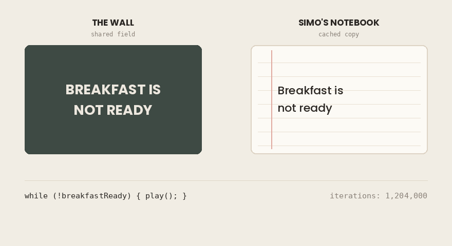
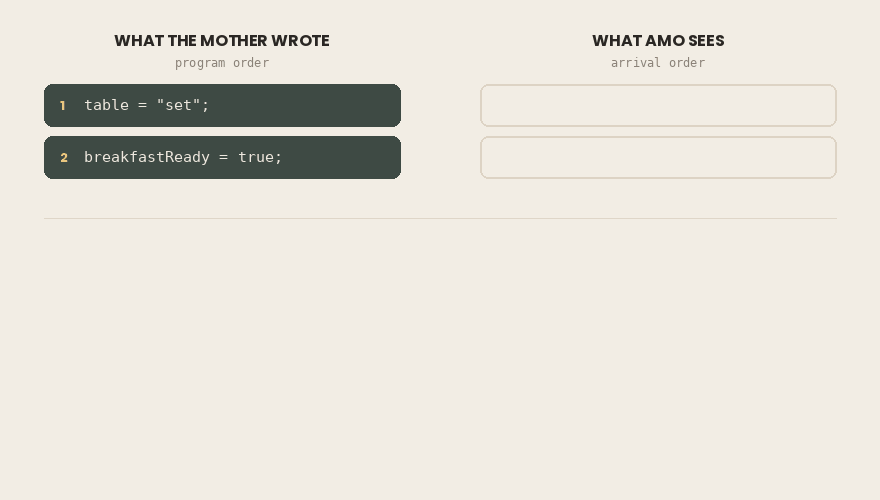
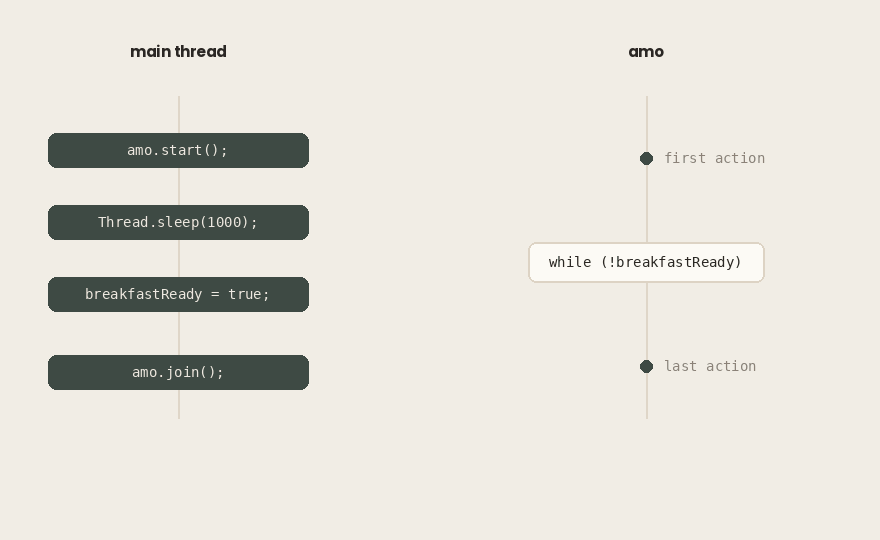
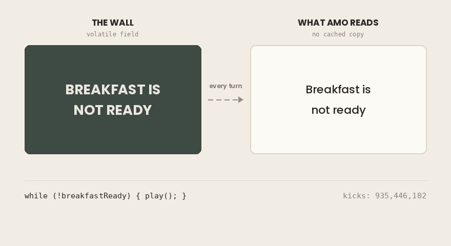
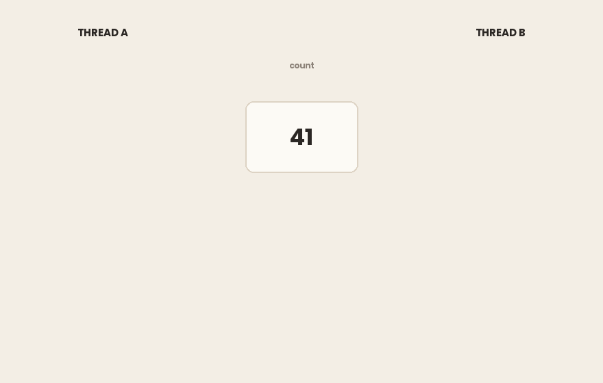

## TL;DR

- A non-`volatile` field written by one thread may **never** become visible to another thread. This is not a delay. There is no amount of waiting that fixes it.
- The **JIT compiler** can relocate a field read out of a loop, turning `while (!flag) {}` into `if (!flag) { while (true) {} }`. The loop then spins forever.
- The compiler and the CPU may also **reorder** your writes. Another thread can see write #2 before write #1. This is legal.
- The **Java Memory Model (JMM)** is a specification, not a description of hardware. It lists what *cannot* happen. Anything not forbidden is allowed.
- **happens-before** is the only ordering relation that matters. Without a happens-before edge between a write and a read, nothing is guaranteed.
- The edges come from a short list: program order, monitor unlock/lock, `volatile` write/read, `Thread.start()`, `Thread.join()`, interruption, default initialization — plus transitivity.
- `volatile` creates an edge. It publishes **everything** the writing thread did before the write, not just the marked field.
- `volatile` gives you **visibility**, not **atomicity**. `count++` is still three operations and is still broken under concurrency.

On cool summer mornings, Amo would sneak out to the street and play ball while his parents were still asleep.

There was only one rule: he had to come home when breakfast was ready. And rather than shout across the street and wake the neighbors, Amo’s mother would write the news on the wall in front of the house.

*Breakfast is not ready.*

The wall stood at the far end of the street. Checking it meant stopping the game, running down, reading, and running back.

That is what he did, the first few mornings.

That morning, Amo’s mother came out of the kitchen, picked up the chalk, wiped the wall clean and wrote a new message:

**BREAKFAST IS READY!**

Then she went back inside. She set the table. She poured the tea. From somewhere down the street came the steady thud of a ball against a garage door.

Nobody came.

The eggs went cold.

The same thing happens in Java:

```java
public class Breakfast {

    static boolean breakfastReady = false;

    public static void main(String[] args) throws InterruptedException {
        Thread amo = new Thread(() -> {
            long kicks = 0;
            while (!breakfastReady) {
                kicks++;
            }
            System.out.println("Amo came home after " + kicks + " kicks.");
        });

        amo.start();
        Thread.sleep(1000);

        breakfastReady = true;
        System.out.println("The wall says: BREAKFAST IS READY!");

        amo.join();
        System.out.println("Breakfast is served.");
    }
}
```

```bash
The wall says: BREAKFAST IS READY!
^C
```

On my machine it hangs every time — five runs, five hangs, five interrupts by hand.

The write happened. The message is correct. The program is wrong.

Why?

### In short

- One thread sets a `boolean` to `true`. Another thread loops until it becomes `true`.
- The write clearly happens — you can see the proof printed on the screen.
- The loop never ends. The program has to be killed by hand.

## The Convenient Lie We Believe

> One thread writes to a field. Another thread reads it. The second one sees the value that was written.
>
> Nobody taught you this. You never needed to learn it, because you never thought to question it.

Look at the output again. The write happened — the proof is on the screen. The reader still sees the old value. The **assumption is broken**, and the program that broke it does nothing clever.

Amo did not play alone. His friend Simo played with him, and Simo had a notebook in her pocket.

The notebook was copied from the wall once, at the start of the game. The wall was at the far end of the street, and Simo was not lazy. She was right. Nobody told her to copy it. She worked it out herself.

The wall was updated. The notebook was not.

The first villain: the **stale copy**.



There is a second villain, and it was in the story all along.

The mother wrote READY, then she set the table, then she poured the tea. If Amo had come home between those moments, he would have found an empty table and an empty glass. The message was correct but not real.

**The order you write is not a promise about the order that runs.**

Neither villain is a defect. Both are **optimizations**, and both are usually right. Simo’s notebook saved her a hundred trips down the street, and the reordering that will cost you an afternoon of debugging is the same machinery that makes every other program on your laptop fast enough to use.

> **A word about the wall.**
>
> The notebook is an honest picture of the first villain. There is a thing in the world, it holds a copy, and the copy goes out of date. You can point at it.
>
> The second villain has no such thing. Nothing in the street rearranges the mother’s morning. If she wrote before she set the table, that was her decision — and decisions belong to the programmer. Real reordering is not decided by anyone who wrote the code. It is **permitted** to happen to it.
>
> That is where the wall runs out. You can draw a notebook. You cannot draw a permission.

It is tempting to file this under **slowness**. A copy goes stale, the new value takes a while to arrive, the loop spins a few thousand extra times. Annoying, but limited.

Look again at what happened. Amo did not come home late. He did not come home. The eggs went cold and stayed cold, and the program was still running when you killed it.

There is a smaller thing that should bother you more. Adding a print statement inside the loop changed the outcome. Slowness does not behave like that. Slowness does not care what else is in the room.

So ask the obvious question: how long would you have to wait? There is no number. Not a large one — none. And the missing number is not a gap in this article.

### In short

- Two separate problems can hide a write from another thread: a **stale copy**, and **reordering**.
- Neither one is a bug in the JVM. Both are optimizations that are correct almost all the time.
- This is not slowness. Slow means late. This means never.

## Visibility: Seeing Is Not Guaranteed

The obvious explanation is that the value arrives late.

It is a reasonable theory, and it deserves a fair test. Caches go stale everywhere in computing, and stale things get refreshed. Your DNS resolver catches up. Your CDN catches up. Your browser catches up if you wait long enough or press reload twice. The word *cache* carries a promise inside it: wrong for now, right eventually. A few million wasted iterations is nothing to a modern processor. Amo is slow to notice. Amo will notice.

Two experiments say otherwise.

The first one you may have already run by accident. Put a `println` inside the loop, next to where Amo kicks the ball, and the program stops — on my machine, after about thirteen million kicks. Nothing about the waiting changed. What changed is that **something else is now in the room**. Slowness does not care what else is in the room.

The second experiment is harder to argue with, because it does not touch the code at all.

```bash
$ java Breakfast.java
The wall says: BREAKFAST IS READY!
^C
```

```bash
$ java -Xint Breakfast.java
The wall says: BREAKFAST IS READY!
Amo came home after 105349152 kicks.
Breakfast is served.
```

`-Xint` tells the JVM to run in interpreter mode and skip optimization.

> **Environment**
>
> - Intel Core i7–4700HQ (4 cores / 8 threads, x86–64)
>
> - 16 GB DDR3
>
> - Ubuntu 26.04
>
> - Amazon Corretto 21.0.11 (OpenJDK 21, HotSpot, mixed mode)

Same file. Same machine. One flag. The second run comes home after a hundred million kicks — **far more waiting** than the first run ever needed. It waited longer and it succeeded. The first waited forever and failed.

So what changed is not how long anyone waited. What changed is **what the machine was allowed to do with the code**.

This is worth sitting with, because the instinct now is to reach for a fix. Wait longer. Put a `Thread.sleep` in the loop. Call `Thread.yield`. Give the loop more work so it runs slower.

Some of these will appear to work.

That is the worst outcome available to you. A change that hides the failure without promising anything has not fixed the program. It has removed your only evidence that something is wrong. The bug survives, the symptom leaves, and you ship with confidence you have not earned. This is the shape of every **Heisenbug**: it reacts to being watched, and looking at it the wrong way makes it disappear.

Ask the question directly. How long would you have to wait?

There is no answer. Not a large number, not an unpredictable one — **there is no number**, because time is not the missing ingredient. Waiting longer cannot get you there, in the same way that waiting cannot turn Monday into Tuesday if the calendar has stopped.

Which means the question was wrong. Asking *how long* is asking for the size of something that was never there.

The right question is what would make the value visible **at all** — not sooner, but at all. Somebody has to promise that a write becomes visible to a reader. Nothing in the program we have written contains such a promise.

So: who promises what, and to whom?

### In short

- Adding a `println` inside the loop makes the program stop. Timing does not work that way.
- Running with `-Xint` makes the program stop, with **no code change at all**.
- The `-Xint` run waited eight times longer than the broken run and still finished. So waiting was never the problem.
- There is no amount of time that fixes this. The guarantee is missing, not late.

## Reordering: The Order You Write Is Not The Order It Runs

“Why does the value never become visible?” is settled. The new question: even when the value does become visible, in what order does it arrive?

```java
// mother
table = "set";
breakfastReady = true;
```

```java
// Amo
if (breakfastReady) {
    eat(table);      // table may still be null
}
```

Amo’s reasoning is sound. The wall says READY, so the mother wrote it; she writes it when the table is set; therefore the table is set. Every step follows. He walks in and finds an empty table.

Only one link in that chain is broken, and it is not the one you would suspect. He read the flag correctly. The mother did set the table first. Her order was right from beginning to end.

The broken link is the one nobody writes down: **that the order she worked in is the order Amo gets to see.**

Inside a single thread, that order is real. `table = "set"` genuinely happens before `breakfastReady = true`, and any code in that thread will see it that way. The guarantee is airtight — and it covers **exactly one observer**.

Amo is a different observer. Nothing was promised to him.

So `table` being null while `breakfastReady` is true breaks no rule. The comment in that snippet is not warning you about a rare race under load. It is describing what the program is permitted to do. Not unlikely, not timing-dependent: **legal**.



The compiler and the CPU are both free to reorder your instructions. The one constraint: a **single-threaded observer** must not be able to tell.

Three layers can reorder what you wrote: the **compiler and JIT**, the **CPU** itself (out-of-order execution, store buffers), and the **memory system** beneath it. Most developers assume the CPU is the culprit. More often it is the compiler — and the JIT keeps rewriting code that is already running.

You do not have to take this on faith. Run the first program again with one extra flag:

```bash
java -XX:+PrintCompilation Breakfast.java 2>&1 | grep Breakfast
```

```bash
620 1385 %     3       me.yakar.Breakfast::lambda$main$0 @ 2 (28 bytes)
621 1387 %     4       me.yakar.Breakfast::lambda$main$0 @ 2 (28 bytes)
```

The `%` means **on-stack replacement**: the loop was already running when its code was swapped underneath it. The `3` and `4` are compiler tiers — first C1, then C2, each optimizing more aggressively than the last.

Now compare the timestamps with the program. The main thread sleeps for one second before it sets the flag. Both recompilations happened at around 620 ms — while Amo was already spinning, and **before the write ever took place**. By the time the mother picked up the chalk, the loop had already been rewritten twice, and the version running at that moment was the most optimized one the JVM could produce.

The code that eventually ran is not the code you wrote, and it was not even chosen when the program started.

x86 gives you **strong ordering**. Stores become visible in the order they were issued, so several categories of reordering never surface there — though not all of them. **ARM** and **POWER** promise far less, and they are what your phone runs on, and increasingly your servers.

Every experiment in this article ran on x86–64. So there are reorderings I cannot show you here: not because they are rare, but because this hardware suppresses them. Elsewhere it does not. And the hardware is only one of the three layers — the compiler above it is free to reorder on x86 too, as the first program already demonstrated on this very machine.

“It works on my machine” is not weak evidence here. **It is not evidence.**

Two villains, then. One never shows you the value. The other shows it in an order you did not write.

Neither is malfunctioning. The JIT kept its promise: no single-threaded observer could tell the difference. The CPU kept its promise. x86 kept its promise. Every layer behaved exactly as specified.

Nobody ever made a promise to your **second thread**.

### In short

- Compiler, JIT, CPU, and memory system may all reorder your instructions.
- The only rule they must obey: a **single-threaded** observer must not notice. Your other thread is not that observer.
- `-XX:+PrintCompilation` shows the loop being recompiled twice while it is already running.
- x86 hides some reorderings. ARM and POWER do not. The same code can behave differently on different hardware.

## The Java Memory Model (JMM): A Contract, Not a Machine

“Nobody ever made a promise to your second thread.” So who does make one?

The **JMM** does. It is not a machine. It is a model that defines what one thread is guaranteed to see of another thread’s work, and in what order.

When you picture the JMM, you probably picture hardware: caches, cores, store buffers. That is the notebook again — and you were warned about it. You can sketch a notebook, but not a permission. The picture is useful for intuition and wrong as a definition.

Here is the evidence. How else do you get two different outcomes from the same program on the same machine? Recall `-Xint`. One flag, no code change, no hardware change — and the loop that ran forever now terminates. What changed is what the JVM was **permitted** to do. If a rule cannot be read off the hardware, the hardware is not its source.

So who are the parties?

On one side, you. On the other, every JVM implementation on every architecture it will ever run on — HotSpot on x86, OpenJ9 on POWER, whatever runs on hardware that has not been designed yet. The JMM does not describe how one machine behaves. It defines the **minimum** every one of them must follow.

And here the contract runs in the direction you would not expect. It does not tell you what *will* happen. It tells you what *cannot* happen. It is a **list of prohibitions**, not a list of promises.

Which means anything not prohibited is legal. The run you observed is one lawful execution out of many. Tomorrow you may get a different one, and both are correct. This is why **testing cannot prove the absence of a concurrency bug**: a green test suite tells you which execution you happened to get, not which ones were available.

You might conclude from all this that you have been given nothing. The opposite is true. The contract is exactly what lets you write code on a MacBook and run it on an ARM server without thinking about either. Without it, “write once, run anywhere” would still hold for a single thread and quietly break the moment you started a second one — and you would be tuning for store buffers per architecture, by hand.

So: there is a contract. The parties are known. One question remains.

What language are its clauses written in?

### In short

- The JMM is a **specification**, not a description of any particular CPU.
- It binds every JVM on every architecture, including hardware that does not exist yet.
- It works by listing what **cannot** happen. Everything else is allowed.
- A passing test shows you one legal execution. It does not show you the others.

## Happens-Before: The Fine Print of the Contract

In ordinary speech, “one thing happens before another” is a claim about time — hours, minutes, one clock reading smaller than another. Here that instinct is a trap. The clauses of this contract are not about **time**. They are about **order**.

When A **happens-before** B, everything A did is visible to B, and B is ordered after it. That is the whole content of the phrase.

The hyphen matters. **happens before ≠ happens-before.**

The mother’s scene gives you this for free. `table = "set"` literally happened before `breakfastReady = true` — by any clock you care to hold up. But there was no happens-before edge reaching Amo, so nothing was guaranteed to him. Time passed. The guarantee did not.

The contract has a short list of clauses. Each one creates a happens-before edge; nothing else does.

**Program order.** Within a single thread, each action happens-before every action that comes after it in the source. Airtight, and limited to one thread.

**Monitor lock.** An unlock on a monitor happens-before every later lock on that same monitor.

**Volatile.** A write to a `volatile` field happens-before every later read of that same field.

**Thread start.** A call to `start()` on a thread happens-before any action in the started thread.

**Thread termination.** All actions in a thread happen-before another thread returns from `join()` on it.

**Interruption.** A thread interrupting another happens-before the interrupted thread detects it.

**Initialization.** The default initialization of a field — `0`, `false`, `null` — happens-before any other action in the program.

And the rule that makes the rest worth having:

**Transitivity.** If A happens-before B and B happens-before C, then A happens-before C.

Two of these clauses mention a specific keyword and a specific method pair. Everything else on the list is either automatic or something you already do without thinking.

Which brings us to an uncomfortable observation about the program you have been running since the beginning. It already contains **two happens-before edges**. You wrote them without noticing.

`amo.start()` is one: everything the main thread did before that call is guaranteed visible to Amo. `amo.join()` is the other, running the opposite way — everything Amo did is guaranteed visible to the main thread once `join()` returns.

Look at where the write sits:

```java
amo.start();             // edge #1
Thread.sleep(1000);
breakfastReady = true;   // no edge
amo.join();              // edge #2
```



The write happens **after** `start()`, so the start rule does not cover it. It happens **before** `join()` returns, but Amo is not reading anything after `join()` — he is spinning inside it. The one write that matters in the entire program is the one action not attached to any edge on the list.

That is the bug. Not a cache, not a compiler, not an architecture. **A missing clause.**

Earlier we called reordering a permission. Happens-before is the leash.

Where an edge exists, reordering does not disappear — the machine may still shuffle instructions underneath. What it may not do is let the shuffling **become visible** across the edge. This is the same shape as before: the contract does not describe what the hardware does. It describes what you are allowed to observe.

So you now know the language the clauses are written in, and you know your program is missing one.

You still do not know how to write one.

### In short

- **happens-before** is about ordering and visibility, not about the clock.
- Something happening earlier in time guarantees nothing across threads.
- The full list of edges is short: program order, monitor unlock/lock, `volatile` write/read, `start()`, `join()`, interruption, default initialization — plus transitivity.
- Our program already had two edges (`start()` and `join()`). The one write that mattered had none.

## volatile: The Always-Synced Field

Go back to the list. One clause does exactly what this program is missing: *a write to a volatile field happens-before every later read of that same field.*

So we add one keyword:

```java
static volatile boolean breakfastReady = false;
```

Nothing else in the file changes. Run it again:

```bash
The wall says: BREAKFAST IS READY!
Amo came home after 1700811096 kicks.
Breakfast is served.
```



Amo looked at the wall — the real one, at the far end of the street, the way he did on the first mornings. He read it and ran.

The eggs were still warm.

Half of this is obvious. The read cannot be lifted out of the loop anymore. Every turn goes back to the field and asks again.

That is where most explanations stop. It is the smaller half.

Here is the other one. The edge does not carry only `breakfastReady`. **It carries everything the writing thread did before it.**

Which means the mother’s scene works now, too. `table = "set"` came before the volatile write, so it sits on the safe side of the edge. Amo sees a set table, not a null one.

And `table` is not volatile. Nobody touched it.

None of this is free. But the cost is not where most people put it.

The usual story goes like this: a volatile field skips the cache and goes all the way to RAM, every read, every write. Tidy, memorable, and wrong. If it were true, volatile would be unusable — main memory is roughly two hundred times slower than L1 cache. On x86, a volatile read costs about the same as an ordinary one.

Here is what actually happens.

The **caches were never the problem**. Modern processors keep them in sync with each other, in hardware, without being asked. One core writes a value; the other cores’ caches are told. That machinery runs whether or not you type `volatile`.

What is *not* kept in sync is a copy sitting in a **register**. Registers are the CPU’s private scratch space, and nothing coordinates them with anything. That is where Simo’s notebook really lives. Not in the cache — in a register. The compiler put it there because reading the same field over and over looked wasteful, and nothing forbade it.

So the first half of the cost is paid by the **compiler**. It loses moves. It cannot park the field in a register, cannot lift the read out of the loop, cannot reuse a value it read a moment ago. Every turn is a real read.

The second half is paid on the **write**. On x86, a volatile write is followed by a barrier that forces the processor to push out its pending writes before anything after it may proceed. That waiting is the expensive part. Reads are nearly free; writes are where the bill arrives.

The notebook is gone. Amo runs to the wall every single time — and the mother now waits at the wall until the writing is truly there.

So the program is fixed, the story has an ending, and you have a keyword that solves the problem you started with.

Which is a good moment to be careful.

### In short

- `volatile` creates a happens-before edge, which is exactly the missing clause.
- The edge publishes **everything** the writing thread did before the write — not only the marked field.
- `volatile` does not push data to RAM. Caches are already kept in sync by hardware. What it stops is the compiler keeping a copy in a **register**.
- Reads are cheap. The cost sits on the **write**, because of the memory barrier that follows it.

## What volatile Does NOT Give You

One keyword, one line, problem solved. That is a good feeling, and it is worth keeping — for about a page.

Take the same keyword one step further and watch it come apart.

Two threads, one counter, a million increments each. The field is volatile, so visibility is handled.

```java
public class Counter {
    static volatile int count = 0;

    public static void main(String[] args) throws InterruptedException {
        Runnable job = () -> {
            for (int i = 0; i < 1_000_000; i++) {
                count++;
            }
        };

        Thread a = new Thread(job);
        Thread b = new Thread(job);

        a.start(); b.start();
        a.join();  b.join();

        System.out.println("expected: 2000000");
        System.out.println("actual:   " + count);
    }
}
```

```makefile
expected: 2000000
actual:   1422924
```

Run it again and you get a different number. Run it a few more times and you may get the right one, which is worse than getting the wrong one — the same point the reordering section made, arriving again from a different direction.

Nearly six hundred thousand increments are missing. Where did they go?

`count++` looks like one instruction. **It is three.**

Read the value. Add one. Write it back.

Now put two threads inside those three steps. Both read 41. Both add one. Both write 42. Two increments went in, one came out.



Look closely at what did *not* go wrong there. Nothing was stale. Both threads read a perfectly current value — the volatile clause did its job exactly as written. They just read the **same** one.

These are two different guarantees, and it is worth saying their names out loud.

**Visibility** is about whether you see the latest value. **Atomicity** is about whether an operation can be interrupted halfway through.

`volatile` gives you the first. It has never given you the second. Everything in this article up to now has been about the first one.

This is not a gap in the language, and it is not a defect in `volatile`. Go back to the clause: *a write to a volatile field happens-before every later read of that same field.* Read it again and notice what it does not mention. It says nothing about two threads taking turns. Nothing about an operation running start to finish without interference.

You asked the contract for a term that was never in it. And the contract did what it has done all along — it kept its word, precisely, and no further.

The tools for the other guarantee exist, and they are not this one. `AtomicInteger` for a counter like this. `synchronized` or a `Lock` when several fields have to move together. `LongAdder` when the counter is hot and heavily contended. Each of those deserves its own article. None of them is `volatile`.

So keep the keyword, and keep it for what it is: the right tool for a narrow job. One thread writes a value, other threads read it, and nobody’s write depends on what they just read. A status flag. A shutdown signal. A reference published once and then left alone.

The moment a write depends on the value you just read, `volatile` is no longer enough — and you need a different clause.

### In short

- `volatile` gives **visibility**. It does not give **atomicity**.
- `count++` is read, add, write. Two threads can sit inside those three steps and lose an update.
- Nothing was stale in that failure. Both threads read a current value — the same one.
- Use `AtomicInteger`, `synchronized`, a `Lock`, or `LongAdder` when a write depends on the value just read.

## The Contract Cheat Sheet

You started with a program that would not stop. You now know why, and the answer turned out to have almost nothing to do with the program.

Here is what to carry out of it.

**1. Visibility is not a matter of time.**

A value that is not guaranteed to arrive does not arrive late. It may not arrive at all. There is no duration that fixes a missing guarantee, which is why adding a sleep, slowing the loop, or waiting longer are not fixes — at best they hide the failure and cost you the evidence.

**2. The order you write is not the order that runs.**

The compiler, the JIT, and the processor may all rearrange your instructions. The single constraint is that a single-threaded observer must not be able to tell. Your second thread is not that observer.

**3. The JMM is a contract, not a machine.**

It does not describe caches, cores, or store buffers. It defines the minimum every JVM on every architecture must honor. It works by listing what cannot happen, which means everything not forbidden is legal — and the run you observed was one lawful execution out of many. Testing shows you which one you got, not which ones were available.

**4. Happens-before is the only currency.**

Nothing is visible across threads unless an edge makes it so. The clauses are short and there is no secret extra one: program order, monitor unlock to lock, volatile write to read, `start()` into a thread, a thread into `join()`, interrupt to detection, default initialization. And transitivity, which is what lets them chain into something useful.

**5.** `volatile` **buys visibility, not atomicity.**

It creates an edge, and the edge carries everything the writing thread did before it — not just the field you marked. What it does not do is make an operation indivisible. `count++` is still three steps, and two threads still fit inside them.

**The question to ask**

When you next see a field touched by more than one thread, do not ask whether it looks thread-safe. Ask two things instead:

**Who writes it, and which clause guarantees that the reader sees it?**

If you cannot name the clause, there isn’t one. Not a small guarantee, not a probable one, not one that holds most of the time on your laptop. There isn’t one.

The eggs go cold quietly, and the program keeps running.

## References

**Specification**

- *The Java® Language Specification, Chapter 17: Threads and Locks* (§17.4.5).
 [https://docs.oracle.com/javase/specs/jls/se8/html/jls-17.html](https://docs.oracle.com/javase/specs/jls/se8/html/jls-17.html)
- *JSR-133: Java Memory Model and Thread Specification* (2004)
 [https://www.cs.umd.edu/~pugh/java/memoryModel/jsr133.pdf](https://www.cs.umd.edu/~pugh/java/memoryModel/jsr133.pdf)
- *JSR-133 (Java Memory Model) FAQ* 
 [https://www.cs.umd.edu/~pugh/java/memoryModel/jsr-133-faq.html](https://www.cs.umd.edu/~pugh/java/memoryModel/jsr-133-faq.html)

**Implementation and hardware**

- Doug Lea, *The JSR-133 Cookbook for Compiler Writers*
 [https://gee.cs.oswego.edu/dl/jmm/cookbook.html](https://gee.cs.oswego.edu/dl/jmm/cookbook.html)
- Rajiv Prabhakar, *Myths Programmers Believe about CPU Caches*
 [https://software.rajivprab.com/2018/04/29/myths-programmers-believe-about-cpu-caches/](https://software.rajivprab.com/2018/04/29/myths-programmers-believe-about-cpu-caches/)
